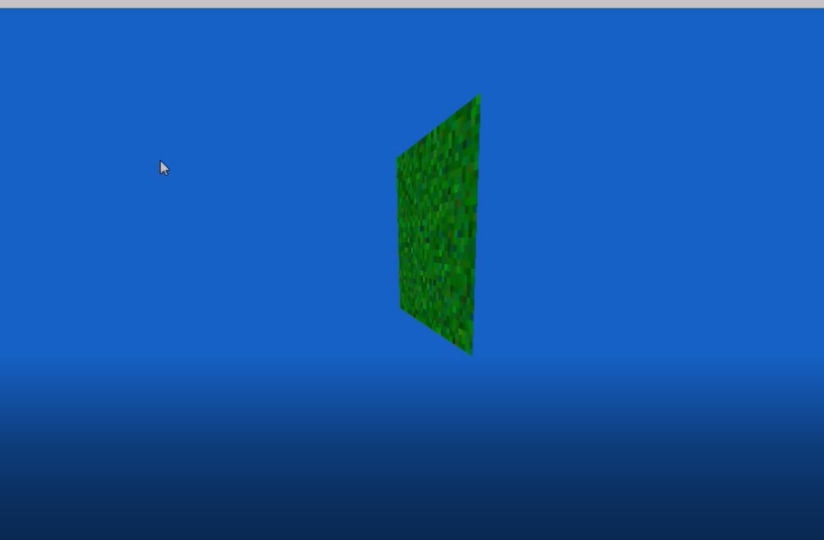
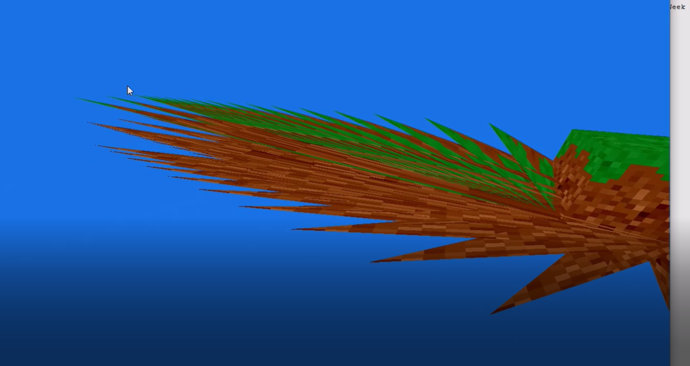
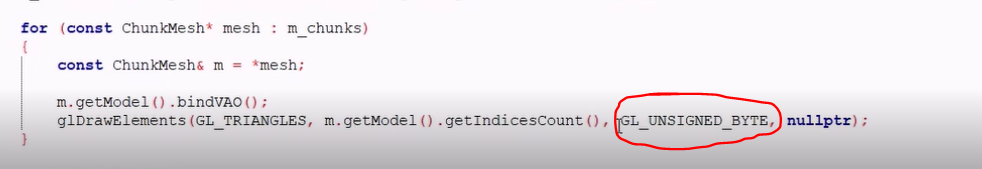
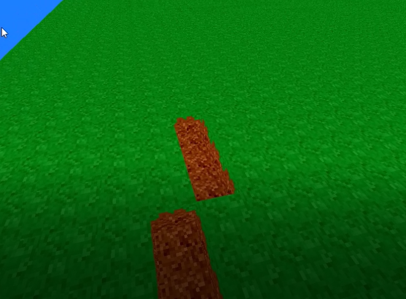
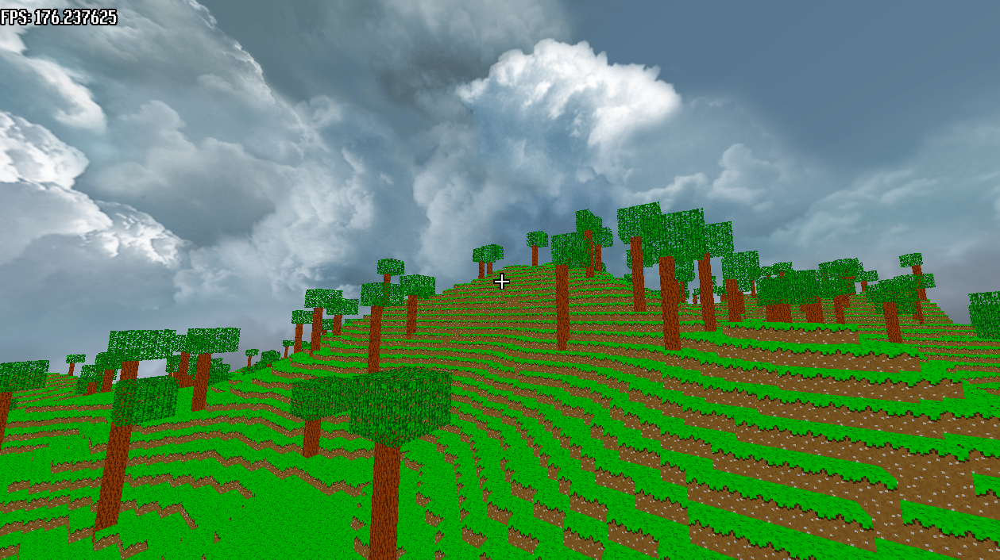

# HelloMine3D

HelloMine3D is a C++ Minecraft-style voxel sandbox derived from the original one-week challenge
project.

## Project Layout

The project has been reorganized with the same broad shape as `HelloOgre3D`:

| Path | Responsibility |
| ---- | -------------- |
| `src/HelloMine3D/` | Game and engine source code. |
| `src/external/` | Small vendored libraries used directly by the build. |
| `media/` | Runtime assets: blocks, textures, shaders, and fonts. |
| `bin/` | Runtime configuration and generated executable. |
| `docs/` | Architecture notes and documentation images. |
| `scripts/` | Build, run, and debug helpers. |

See `docs/architecture.md` for the current code boundaries and the mapping from the original
project layout.
See `docs/iteration-plan.md` for the recommended HelloMine3D iteration roadmap.
See `docs/minigame-reference.md` for notes on MiniGame modules that can inform future voxel,
resource, terrain, tooling, and platform work.

Original challenge video: https://www.youtube.com/watch?v=Xq3isov6mZ8

Note: I continued to edit after the 7 days, however the version seen in the video is found here https://github.com/Hopson97/MineCraft-One-Week-Challenge/tree/eb01640580cc5ad403f6a8b9fb58af37e2f03f0c

And the "optimized" version can be found here: https://github.com/Hopson97/MineCraft-One-Week-Challenge/tree/792df07e9780b444be5290fd05a3c8598aacafc8 (~1 week later version)

There also is a version of this game with very good graphics, and things like a day/night cycle. However, it was causing rendering issues for many people. This version can be found here:
https://github.com/Hopson97/MineCraft-One-Week-Challenge/tree/aa50ad8077ef0e617a9cfc336bdb7db81c313017

## Other People's Projects

This was made in a week, as a challenge for a video. There do exist other, more mature and developed Minecraft clones written in C++.

MineTest here: https://github.com/minetest/minetest

## SFML 3 Update

On November 2nd 2025, this project was updated to use SFML 3.0.0 and various changes were made to the codebase to accommodate this.

To see the commit prior to this change, see: https://github.com/Hopson97/MineCraft-One-Week-Challenge/tree/fead1af708dca0518a6161fbac4c2673393d5ae0

## Building and Running

### Dependencies

The repo can use local dependency drops under `src/external/`:

| Dependency | Expected local path |
| ---------- | ------------------- |
| SFML 3.x | `src/external/sfml/include`, `src/external/sfml/lib` |
| Dear ImGui | `src/external/imgui/imgui.cpp` |
| GLM | `src/external/glm/glm/glm.hpp` |

On Windows, use the Visual C++ 64-bit SFML package and keep its `include/`, `lib/`, and `bin/`
directories under `src/external/sfml/`. Debug builds link the `sfml-*-d.lib` import libraries;
release builds link the non-`-d` libraries. When `src/external/sfml/bin` exists, the Premake
project copies the SFML DLLs into `bin/` after a Visual Studio build.

On macOS, use the Clang/arm64 or universal SFML package. The generated Xcode and Makefile builds
link the dylibs from `src/external/sfml/lib` and embed an rpath back to that directory.

Alternatively, install the packages with vcpkg or your system package manager:

```bash
vcpkg install glm sfml imgui
```

When using vcpkg with Premake, set `VCPKG_ROOT` / `VCPKG_TARGET_TRIPLET`, or pass them explicitly
when generating project files:

```sh
export VCPKG_ROOT=/path/to/vcpkg
export VCPKG_TARGET_TRIPLET=arm64-osx
```

### Build and Run

To generate and build with Premake/Make:

```sh
sh scripts/build.sh
```

To build and run in release mode, simply add the `release` suffix:

```sh
sh scripts/build.sh release
sh scripts/run.sh release
```

The executable is emitted to `bin/HelloMine3D`. Runtime paths are resolved from the project root,
so the binary can be launched from `bin/`, `build/Debug`, or the repository root.

To generate IDE project files without building:

```sh
sh scripts/premake.sh xcode4   # macOS/Xcode
sh scripts/premake.sh gmake    # Makefiles
```

On macOS you can use the HelloOgre3D-style shortcut:

```sh
./xcode.sh
```

On Windows, run `vs2022.bat` from the repository root. The generated project files are written to
`build/`, and the executable still outputs to `bin/HelloMine3D`.

## The Challenge

### Day One

End of day one commit: https://github.com/Hopson97/MineCraft-One-Week-Challenge/tree/44ace72573833796da05a97972be5765b05ce94f

The first day was spent setting up boilerplate code such as the game state/ game screen system, and the basic rendering engines, starting off with a mere quad.

The day was finished off by creating a first person camera.



End of day stats:

| Title                  | Data    |
| ---------------------- | ------- |
| Time programming Today | 3:21:51 |
| Lines of Code Today    | 829     |
| Total Time programming | 3:21:51 |
| Total Lines of Code    | 829     |

### Day Two

End of day two commit: https://github.com/Hopson97/MineCraft-One-Week-Challenge/tree/98055215f735335de80193221a30c0bb8586fba5

The second day was spent setting up the basic ChunkSection and various block classes.

I also worked out the coordinates for a cube, and thus created a cube renderer.

I finished up the day attempting to create a mesh builder for the chunk; however, this did not go well at all, and two had ended before I got it to work correctly.



End of day stats:

| Title                  | Data    |
| ---------------------- | ------- |
| Time programming Today | 4:16:07 |
| Lines of Code Today    | 732     |
| Total Time programming | 7:37:58 |
| Total Lines of Code    | 1561    |

### Day Three

End of day three commit: https://github.com/Hopson97/MineCraft-One-Week-Challenge/commit/78bd637581542576372d75cf7638f76381e933b4

To start the day off, I fixed the chunk drawing. Turns out I was telling OpenGL the indices were `GL_UNSIGNED_BYTE`, but they were actually `GL_UNSIGNED_INT`. This took 3 hours to work out...



Anyways, after this I got the game working with more chunks. I now have an area of 16x16 chunks, made out of chunk sections of 16x16x16 blocks.

To finish the day off, I got some naive block editing to work.



End of day stats:

| Title                  | Data     |
| ---------------------- | -------- |
| Time programming Today | 3:15:38  |
| Lines of Code Today    | 410      |
| Total Time programming | 10:53:36 |
| Total Lines of Code    | 1974     |

### Day 4

The first thing I did on day 4 was create a sky box using OpenGL cube maps.

After this, I started work on the world generation, eg adding height map and trees.



End of day stats:

| Title                  | Data     |
| ---------------------- | -------- |
| Time programming Today | 3:14:15  |
| Lines of Code Today    | 523      |
| Total Time programming | 14:07:51 |
| Total Lines of Code    | 2489     |

### Day 5

I started off the day by cleaning up some of the chunk code, and then proceeded to make the world infinite, but
I felt it was not needed, so I simply went back to a fixed-sized world.

I then added an item system. My implementation probably was not great for this, but it was my first time
at creating that sort of the thing.

Basically, when a player breaks a block, it gets added to their inventory. When they place a block, a block
is placed.

| Title                  | Data     |
| ---------------------- | -------- |
| Time programming Today | 2:54:14  |
| Lines of Code Today    | 560      |
| Total Time programming | 17:02:05 |
| Total Lines of Code    | 3049     |

### Day 6

Mostly optimizations, such as view-frustum culling and making the mesh building faster.

### Day 7

Focus on improving how it looks, eg adding directional lighting

Also implemented concurrency :)
