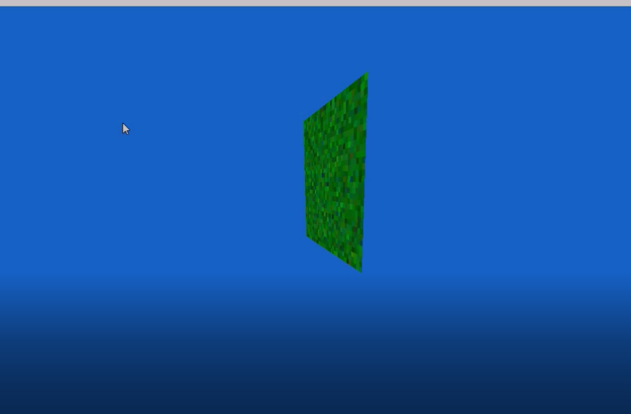
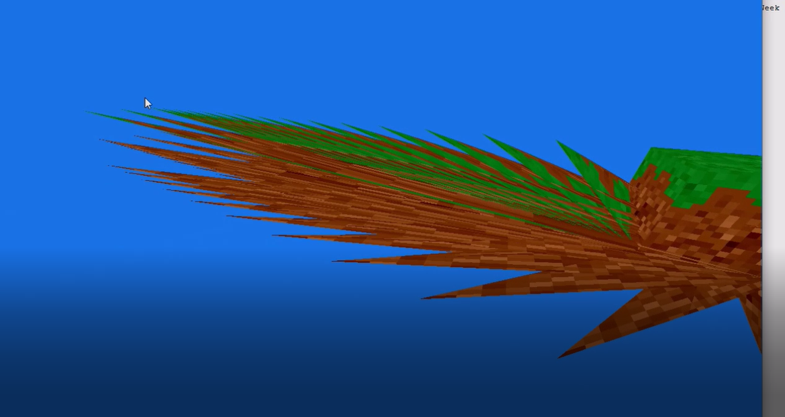
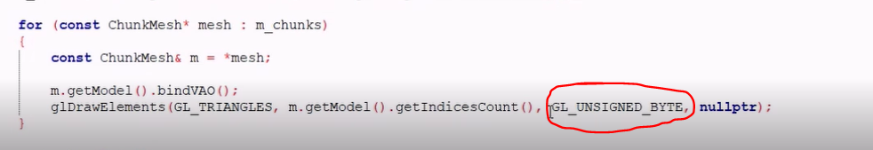
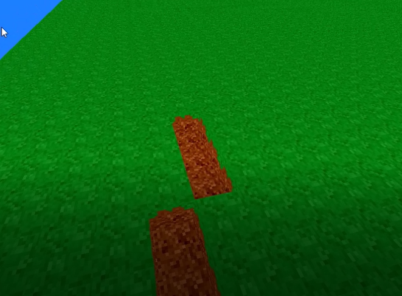
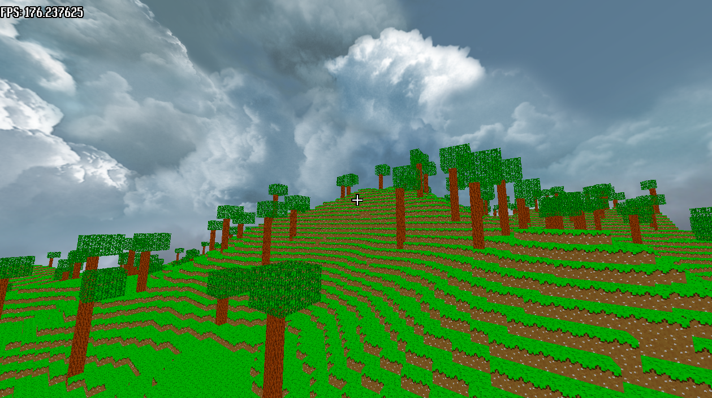

# HelloMine3D

HelloMine3D is a C++ Minecraft-style voxel sandbox derived from the original one-week challenge
project.

## Project Layout

The project has been reorganized with the same broad shape as `HelloOgre3D`:

| Path | Responsibility |
| ---- | -------------- |
| `src/HelloMine3D/` | Game and engine source code. |
| `src/external/` | Small vendored libraries used directly by the build. |
| `media/` | Runtime assets: blocks, textures, shaders, and fonts. |
| `bin/` | Runtime configuration and generated executable. |
| `docs/` | Architecture notes and documentation images. |
| `scripts/` | Build, run, and debug helpers. |

| Document | Contents |
| -------- | -------- |
| `docs/todolist.md` | The executable task list, dependency order, acceptance matrix, and iteration report template. Start here. |
| `docs/architecture.md` | Current code boundaries and the mapping from the original project layout. |
| `docs/sandbox-foundation-todolist.md` | Detailed record of the S0-S7 sandbox foundation milestones. |
| `docs/ogre-migration-plan.md` | Plan for moving the render backend to Ogre 1.10 (milestones E0-E5). |
| `docs/runtime-validation.md` | How runtime behaviour is validated, and what is not covered. |
| `docs/iteration-plan.md` | Long-term iteration roadmap. |
| `docs/render-regression-smoke.md` | Non-intrusive render screenshot smoke. |
| `docs/performance-baseline.md` | Non-intrusive frame timing and chunk counter baseline. |
| `docs/manual-input-acceptance-v1.md` | Versioned physical keyboard/mouse acceptance protocol. |
| `docs/resource-pack-contract.md` | Bounded read-only resource-pack contract and validation. |
| `docs/windows-release-packaging.md` | Deterministic self-contained Windows distribution flow. |
| `docs/chunk-streaming-regression.md` | Diagnosis and fix of the terrain streaming regression. |
| `docs/minigame-reference.md` | Notes on MiniGame modules that can inform future work. |

### Current Development Direction

The selected 13-item Windows D/R/X implementation scope is complete. It now
includes the playable crop/container/combat/persistence slice, a deterministic
world soak, clean-root packaging and the bounded read-only resource-pack layer.
R3 physical-input acceptance remains the first closure action and also closes
the remaining D2, D4 and D6 `Verify` states.

Stage 8 is now planned around sustainable play and reliable releases. Its
16-item K/H/Q/G scope adds durable world management and recovery, local
symbolizable crash artifacts, startup/save/streaming/content-scale performance
budgets, data-driven crafting and tools, pause/settings, basic audio feedback
and a new clean-package vertical slice. See `docs/iteration-plan.md` for phase
ordering and `docs/todolist.md` for the authoritative task contracts.
K1 is now complete: new worlds use version-3 identity metadata and the strict,
read-only catalogue contract is documented in
`docs/world-catalogue-contract-v1.md`.

Native macOS acceptance (B3) is complete on an Apple M1 Pro through the full
Debug/Release Xcode gate. Formal ThreadSanitizer evidence (R4) remains deferred
until a supported sanitizer configuration is available and does not block the
Windows stage.
Multiplayer, scriptable mods,
resource hot reload and additional render backends are not part of the active
scope.

Original challenge video: https://www.youtube.com/watch?v=Xq3isov6mZ8

Note: I continued to edit after the 7 days, however the version seen in the video is found here https://github.com/Hopson97/MineCraft-One-Week-Challenge/tree/eb01640580cc5ad403f6a8b9fb58af37e2f03f0c

And the "optimized" version can be found here: https://github.com/Hopson97/MineCraft-One-Week-Challenge/tree/792df07e9780b444be5290fd05a3c8598aacafc8 (~1 week later version)

There also is a version of this game with very good graphics, and things like a day/night cycle. However, it was causing rendering issues for many people. This version can be found here:
https://github.com/Hopson97/MineCraft-One-Week-Challenge/tree/aa50ad8077ef0e617a9cfc336bdb7db81c313017

## Other People's Projects

This was made in a week, as a challenge for a video. There do exist other, more mature and developed Minecraft clones written in C++.

MineTest here: https://github.com/minetest/minetest

## Historical SFML 3 Update

On November 2nd 2025, this project was updated to use SFML 3.0.0. The active
client has since migrated to Ogre 1.10; this note is retained only to identify
the older history.

To see the commit prior to this change, see: https://github.com/Hopson97/MineCraft-One-Week-Challenge/tree/fead1af708dca0518a6161fbac4c2673393d5ae0

## Building and Running

### Dependencies

The repo builds its local dependencies from vendored source under `src/external/`:

| Dependency | Expected local path |
| ---------- | ------------------- |
| Ogre 1.10 / GL3Plus | `src/Engine/ogre3d`, `src/Engine/ogre3d_glsupport`, `src/Engine/ogre3d_gl3plus` |
| FreeImage / FreeType / zlib / zzip | `src/Engine/ThirdParty/` |
| OIS | `src/external/ois` |
| Dear ImGui | `src/external/imgui/imgui.cpp` |
| Tracy Profiler 0.13.1 (optional) | `src/external/tracy/public/TracyClient.cpp` |
| GLM | `src/external/glm/glm/glm.hpp` |

Premake builds the Ogre, image, font, archive, OIS and ImGui dependency graph
directly from vendored source. `HelloMine3D` is the only client executable and
uses Ogre GL3Plus for rendering; there is no backend selection switch or
checked-in dependency binary tree.

Tracy instrumentation is disabled by default. Generate an instrumented client
only when profiling; `TRACY_ON_DEMAND` keeps capture inactive until a profiler
connects:

```sh
./xcode.sh --with-tracy
xcodebuild -workspace build/HelloMine3D.xcworkspace -scheme HelloMine3D \
  -configuration Release -arch x86_64 build
```

The equivalent generation flag is available to every Premake backend, and the
environment form is convenient for wrappers:

```sh
HELLOMINE3D_ENABLE_TRACY=1 ./xcode.sh
```

Run `bin/HelloMine3D`, open a Tracy 0.13.1-compatible profiler and connect to
the local client. The initial timeline names the main and chunk-loader threads,
marks each Ogre frame, and exposes frame delta, fixed ticks, simulation/world
updates, section upload, actor sync and chunk mesh build zones. When present,
`tools/tracy-viewer/tracy-profiler.exe` is the matching local Windows viewer;
`tools/tracy-viewer/VERSION.txt` records the expected version. Use a matching
Tracy profiler build on macOS.

### Build and Run

To generate and build with Premake/Make:

```sh
sh scripts/build.sh
```

To build and run in release mode, simply add the `release` suffix:

```sh
sh scripts/build.sh release
sh scripts/run.sh release
```

The executable is emitted to `bin/HelloMine3D`. Runtime paths are resolved from the project root,
so the binary can be launched from `bin/`, `build/Debug`, or the repository root.

To generate IDE project files without building:

```sh
sh scripts/premake.sh xcode4   # macOS/Xcode
sh scripts/premake.sh gmake    # Makefiles
```

On macOS you can use the HelloOgre3D-style shortcut:

```sh
./xcode.sh
```

On Windows, run `vs2022.bat` from the repository root, then build `build/HelloMine3D.sln`. The
generated project files are written to `build/`, and the executable still outputs to
`bin/HelloMine3D.exe`.

```powershell
vs2022.bat
& "C:\Program Files\Microsoft Visual Studio\2022\Community\MSBuild\Current\Bin\MSBuild.exe" `
    build\HelloMine3D.sln /p:Configuration=Debug /p:Platform=x64 /m
```

### One-Command Build Verification

Use the platform wrapper below for the same clean project generation,
Debug/Release rebuilds and eight headless test runs expected before a change is
committed:

| Platform | Command | Required host tools |
| -------- | ------- | ------------------- |
| Windows | `powershell -NoProfile -ExecutionPolicy Bypass -File scripts\verify_build.ps1` | Visual Studio 2022 with **Desktop development with C++**; Premake is bundled in `tools/`. |
| Linux | `bash scripts/verify_build.sh` | A C++17 compiler, GNU Make, Premake 5 and the OpenGL/X11 development packages. |
| macOS / Make | `bash scripts/verify_build.sh` | Xcode command-line tools, GNU Make and Premake 5 (`brew install premake`). |
| macOS / Xcode | `bash scripts/verify_xcode.sh` | A graphical macOS session, Xcode command-line tools, Premake 5 and x86_64 execution support. |

Both wrappers stop at the first failed generation, compilation or test step
and print `[BUILD_VERIFY] status=PASS` only after both configurations pass.
The macOS-native Xcode generator remains a separate validation path documented
in the project task list. A Windows host can still validate the generated
workspace contract without claiming a native build:

```powershell
powershell -NoProfile -ExecutionPolicy Bypass -File tools\validate_xcode_generation.ps1
```

This versioned preflight requires the exact 28-project workspace/on-disk
inventory: eleven first-party targets and 17 libraries. It parses every generated
PBX group and cross-project reference, rejecting stale/missing projects,
duplicate children, one child in multiple groups, duplicate `ProjectRef`
entries and undeclared references. It also checks Cocoa/OIS/OSX sources,
platform paths/frameworks, the default-off Tracy boundary, foreign-platform
leakage and the native verifier contract. It cannot replace `xcodebuild`.

On a real macOS host, `scripts/verify_xcode.sh` is the final native gate. It
generates Xcode projects, runs nine positive/negative graph fixtures, validates
the real 28-project graph, builds the client and ten tests in Debug and
Release, runs all 20 test executions, then performs both validation-only and
real-window 120-frame client probes. The real-window probes also verify that the
persisted player remains on the fixed surface fixture. The process prints
`[XCODE_VERIFY] status=PASS` only
after every step succeeds and keeps per-step logs under `build/`.

### Runtime Configuration And State

`bin/config.txt` is a per-user runtime configuration and is intentionally not
tracked. The client creates it when missing with these defaults:

```text
renderdistance 8
fullscreen 0
windowsize 1280 720
fov 90
mousesensitivity 0.05
invertmousey 0
seed random
```

Deleting the file resets these settings on the next launch. The render
distance, fullscreen flag, window size, field of view, mouse sensitivity and
optional vertical-look inversion are read by the Ogre client. Set `seed` to an
integer to reproduce newly created worlds, or leave it as `random`; a saved
world's seed remains authoritative. The
`HELLOMINE3D_SEED` environment variable can still override the configured seed
for a new world during automated runs. Blank lines and `#` comments are
allowed. `bin/Mine.cfg`, `bin/MineResources.cfg` and `bin/resource-packs.txt`
are the repository-owned files in `bin/` and act as runtime templates.
Executables, logs, ImGui state, saves, captures and the legacy unused
`info.txt` are generated local state and remain ignored.

### Validation

The build produces the client plus ten test targets, all of which run headless:

```powershell
bin\HelloMine3DCoordinateTests.exe        # coordinate conversion
bin\HelloMine3DMeshDirtyTests.exe         # mesh dirty planner
bin\HelloMine3DSaveLoadSmoke.exe          # chunk serialization roundtrip
bin\HelloMine3DEntityLifecycleSmoke.exe   # actor lifecycle
bin\HelloMine3DWorldRuntimeSmoke.exe      # full world/actor stack, 342 assertions
bin\HelloMine3DSoak.exe                   # deterministic world stability schedule
bin\HelloMine3DResourcePackSmoke.exe      # resource resolver and frozen view
bin\HelloMine3DRecipeSmoke.exe            # strict startup recipe registry
bin\HelloMine3DWorldCatalogueSmoke.exe    # world identity/catalogue contract
bin\HelloMine3DStorageTransactionSmoke.exe # atomic save/failure recovery
```

Asset and data changes should also run the reference-aware asset check:

```sh
sh scripts/check_assets.sh
```

It validates registered block definitions and their named shape resources,
Ogre shader and texture references, the bundled font, resource locations, and
the checked-in runtime templates. Non-cube block definitions use
`MeshType 1` plus `Shape <name>`; each `media/shapes/<name>.shape` file contains
one or more `Face` entries with 12 normalized vertex coordinates.

The client also has a deterministic validation-only startup that does not
create a render window:

```powershell
$env:HELLOMINE3D_VALIDATE_ONLY = "1"
$env:HELLOMINE3D_SEED = "20260809"
$env:HELLOMINE3D_PLAYER_POSITION = "264 96 8"
bin\HelloMine3D.exe
```

Two client-level smokes exercise the assembled game without stealing focus or the mouse:

```powershell
powershell -ExecutionPolicy Bypass -File tools\run_render_capture.ps1 -StopExisting -CaptureMs 4000,6000 -Seconds 12 -PlayerRotation "20 118.4 0"
powershell -ExecutionPolicy Bypass -File tools\run_perf_baseline.ps1 -StopExisting -WarmupMs 3000 -DurationMs 10000
powershell -ExecutionPolicy Bypass -File tools\compare_perf_baselines.ps1 -Baseline <accepted-run> -Candidate <candidate-run>
```

Pass `-WorldTime 6000` for deterministic noon or `-WorldTime 18000` for
deterministic midnight captures. One full day is 24,000 fixed simulation ticks.

On Windows, fatal startup and resource errors remain complete on stderr and are
also shown in a modal error dialog. The non-interactive regression is:

```powershell
powershell -ExecutionPolicy Bypass -File tools\validate_startup_errors.ps1
```

The startup resource inventory is generated from registered blocks and the
references in block, material and program files. Regenerate or verify the
checked-in manifest with:

```powershell
powershell -ExecutionPolicy Bypass -File tools\generate_resource_manifest.ps1
powershell -ExecutionPolicy Bypass -File tools\generate_resource_manifest.ps1 -Check
powershell -ExecutionPolicy Bypass -File tools\validate_resource_manifest.ps1
```

The last command also proves that a missing expected entry and an unreferenced
stale entry fail even when every resource file still exists.

Resource packs are enabled in priority order through `bin/resource-packs.txt`.
They may override only existing manifest entries and are frozen at startup:

```powershell
powershell -ExecutionPolicy Bypass -File tools\validate_resource_packs.ps1
```

For long-lived world regression and a self-contained Windows Release package:

```powershell
powershell -ExecutionPolicy Bypass -File tools\run_world_soak.ps1 -DurationSeconds 1800 -Formal
powershell -ExecutionPolicy Bypass -File tools\package_windows_release.ps1 -IncludePack example-stone
```

Generated soak evidence, package directories and ZIPs stay under `bin/` and
remain ignored. See the resource-pack and Windows-packaging documents above
for their security boundary, deterministic inventory and negative checks.

See `docs/runtime-validation.md` for what each layer covers.

## The Challenge

### Day One

End of day one commit: https://github.com/Hopson97/MineCraft-One-Week-Challenge/tree/44ace72573833796da05a97972be5765b05ce94f

The first day was spent setting up boilerplate code such as the game state/ game screen system, and the basic rendering engines, starting off with a mere quad.

The day was finished off by creating a first person camera.



End of day stats:

| Title                  | Data    |
| ---------------------- | ------- |
| Time programming Today | 3:21:51 |
| Lines of Code Today    | 829     |
| Total Time programming | 3:21:51 |
| Total Lines of Code    | 829     |

### Day Two

End of day two commit: https://github.com/Hopson97/MineCraft-One-Week-Challenge/tree/98055215f735335de80193221a30c0bb8586fba5

The second day was spent setting up the basic ChunkSection and various block classes.

I also worked out the coordinates for a cube, and thus created a cube renderer.

I finished up the day attempting to create a mesh builder for the chunk; however, this did not go well at all, and two had ended before I got it to work correctly.



End of day stats:

| Title                  | Data    |
| ---------------------- | ------- |
| Time programming Today | 4:16:07 |
| Lines of Code Today    | 732     |
| Total Time programming | 7:37:58 |
| Total Lines of Code    | 1561    |

### Day Three

End of day three commit: https://github.com/Hopson97/MineCraft-One-Week-Challenge/commit/78bd637581542576372d75cf7638f76381e933b4

To start the day off, I fixed the chunk drawing. Turns out I was telling OpenGL the indices were `GL_UNSIGNED_BYTE`, but they were actually `GL_UNSIGNED_INT`. This took 3 hours to work out...



Anyways, after this I got the game working with more chunks. I now have an area of 16x16 chunks, made out of chunk sections of 16x16x16 blocks.

To finish the day off, I got some naive block editing to work.



End of day stats:

| Title                  | Data     |
| ---------------------- | -------- |
| Time programming Today | 3:15:38  |
| Lines of Code Today    | 410      |
| Total Time programming | 10:53:36 |
| Total Lines of Code    | 1974     |

### Day 4

The first thing I did on day 4 was create a sky box using OpenGL cube maps.

After this, I started work on the world generation, eg adding height map and trees.



End of day stats:

| Title                  | Data     |
| ---------------------- | -------- |
| Time programming Today | 3:14:15  |
| Lines of Code Today    | 523      |
| Total Time programming | 14:07:51 |
| Total Lines of Code    | 2489     |

### Day 5

I started off the day by cleaning up some of the chunk code, and then proceeded to make the world infinite, but
I felt it was not needed, so I simply went back to a fixed-sized world.

I then added an item system. My implementation probably was not great for this, but it was my first time
at creating that sort of the thing.

Basically, when a player breaks a block, it gets added to their inventory. When they place a block, a block
is placed.

| Title                  | Data     |
| ---------------------- | -------- |
| Time programming Today | 2:54:14  |
| Lines of Code Today    | 560      |
| Total Time programming | 17:02:05 |
| Total Lines of Code    | 3049     |

### Day 6

Mostly optimizations, such as view-frustum culling and making the mesh building faster.

### Day 7

Focus on improving how it looks, eg adding directional lighting

Also implemented concurrency :)
