# HelloMine3D

**A C++ voxel sandbox built as an architecture and engineering-practice laboratory.**

It is a playable Minecraft-style single-player game — world creation, mining, crafting, tool
progression, smelting, food, combat, exploration and a victory loop — but the point of the
repository is *how* it is built: every persisted format is versioned and migrated, every feature
batch is frozen in a written contract before code, and every change is gated by a reproducible
Debug + Release verification run.

Originally derived from [Hopson97/MineCraft-One-Week-Challenge](https://github.com/Hopson97/MineCraft-One-Week-Challenge);
the render backend has since moved to Ogre 1.10 / GL3Plus, and the engine, gameplay,
persistence, diagnostics and packaging layers have been rebuilt.

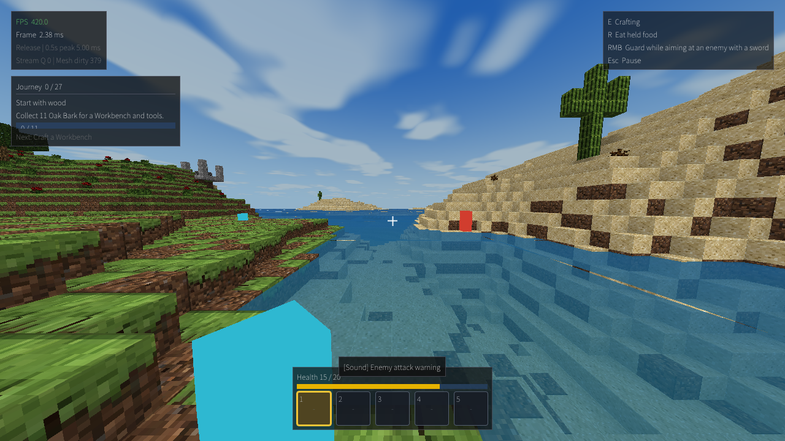

| | |
| --- | --- |
| **Source** | 298 files, ~72.7k lines of C++ |
| **Automated checks** | 937 world-runtime · 122 recipe · 80 resource-pack · 15 startup-negative — Debug and Release complete |
| **Test executables** | 13 |
| **Persisted formats** | save `v12`, terrain `v4`, settings `v8` — every one migrates from `v1` |
| **Performance gates** | 6 versioned scenes with baseline/repeat comparison, bounded stage timings, 2 × 1800 s soak |
| **Distribution** | 104-file self-contained package, verified from an isolated root |
| **Platforms** | Windows (VS2017 / v141, primary) · macOS (historical Xcode/native ThreadSanitizer evidence; new runtime scope is milestone-specific) |

---

## Screenshots

**Per-vertex ambient occlusion** — four-corner neighbourhood sampling, deterministic triangle
diagonals, and greedy merging that only joins faces whose AO gradient stays linearly
reconstructible.

| Without AO | With AO |
| --- | --- |
| 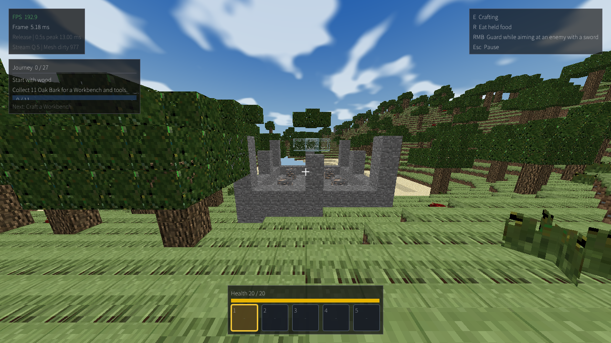 | 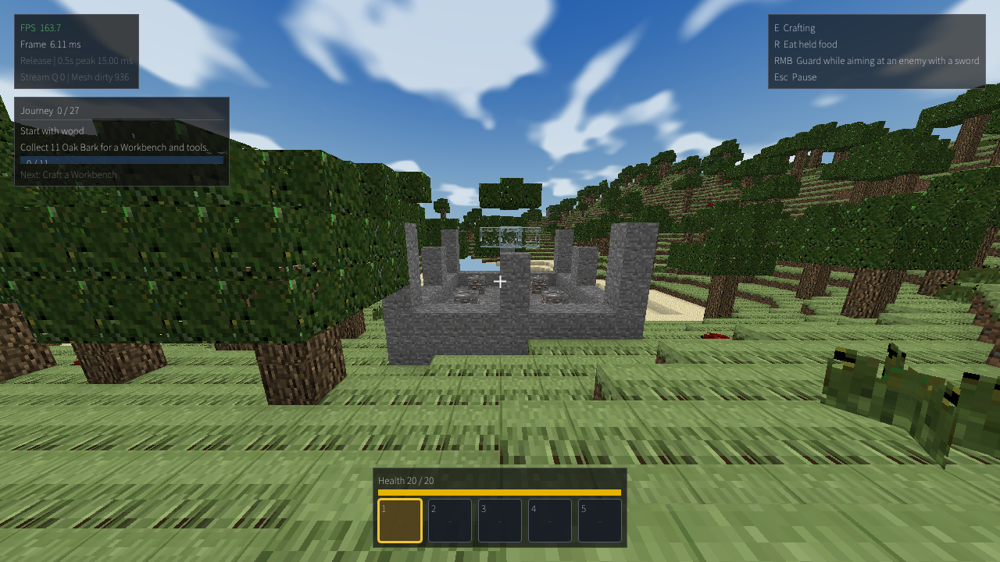 |

**Block light** — a craftable torch feeds the same sky/block light composition the mesh builder
already used, and a burning furnace emits light through metadata-driven emission with exactly
one local relight per state flip.

| Unlit cave | Torch placed |
| --- | --- |
| 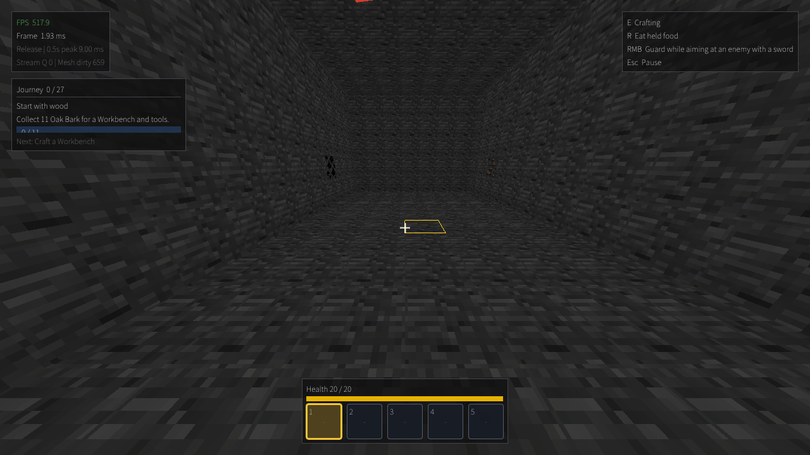 | 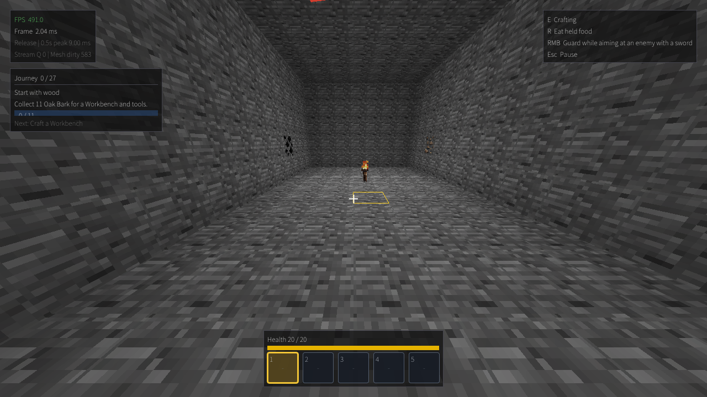 |

**Directional atmosphere** — terrain, water, actors and sky share one fog model that shifts with
the sun direction, beneath an independent cloud layer with height, thickness and parallax.

| Sunward dusk | Backlit dusk |
| --- | --- |
| 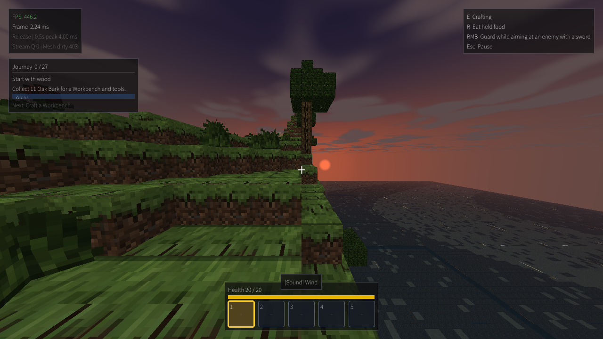 | 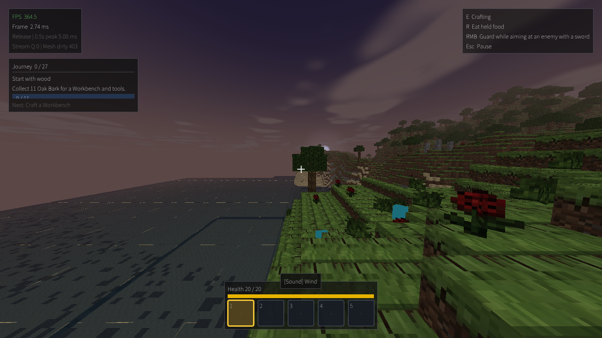 |

**Ecology tinting** — biome-specific surface groups with deterministic per-coordinate tile
variants, all resolved from a frozen atlas profile instead of hard-coded shader constants.

| | |
| --- | --- |
| 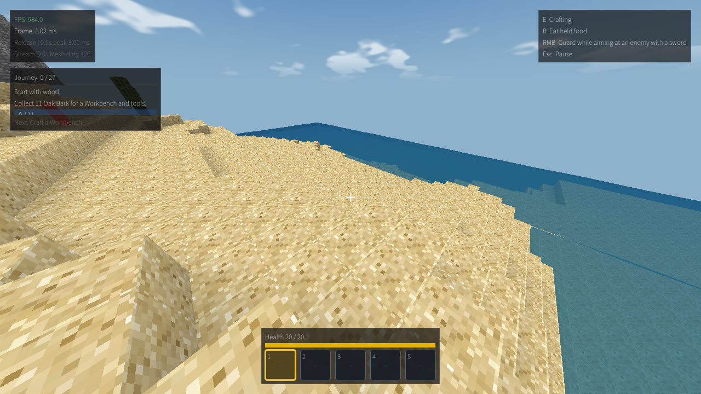 | 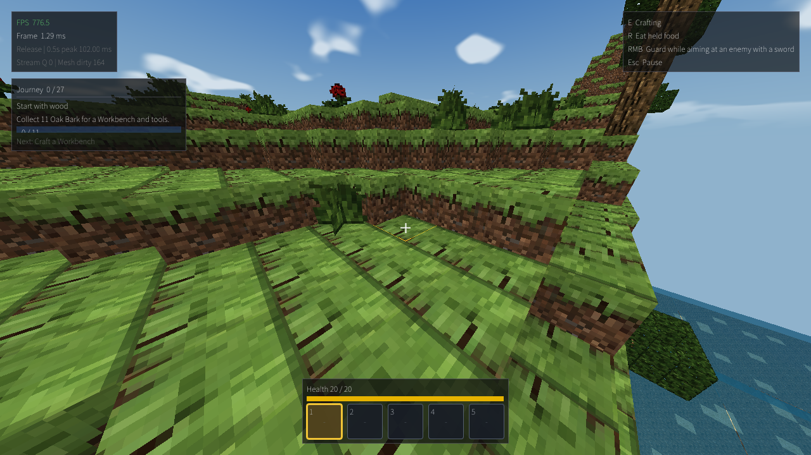 |
| 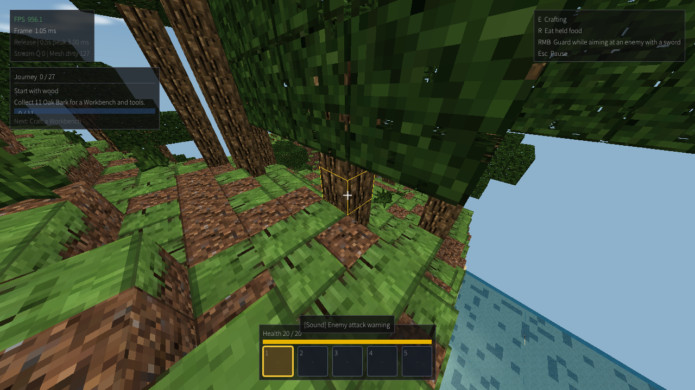 | 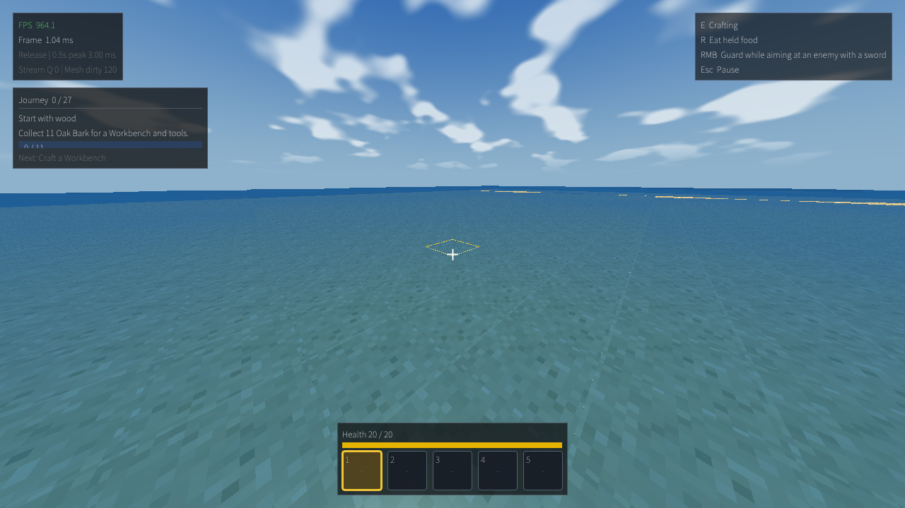 |

Every image above is a fixed-seed, fixed-position, fixed-world-time capture from a hidden
Release client. The full matrices live in [`docs/screenshots/`](docs/screenshots/).

---

## Architecture at a glance

Three rules shape the layout: **Ogre never owns gameplay truth**, **worker threads never touch
authoritative world state**, and **persistence is the only writer of durable data**.

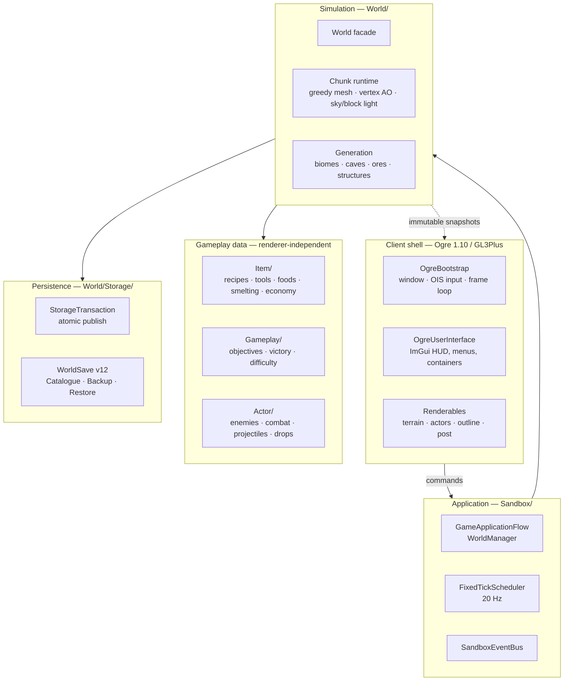
```mermaid
flowchart TB
    subgraph shell["Client shell — Ogre 1.10 / GL3Plus"]
        direction LR
        boot["OgreBootstrap<br/>window · OIS input · frame loop"]
        ui["OgreUserInterface<br/>ImGui HUD, menus, containers"]
        rend["Renderables<br/>terrain · actors · outline · post"]
    end

    subgraph app["Application — Sandbox/"]
        direction LR
        flow["GameApplicationFlow<br/>WorldManager"]
        tick["FixedTickScheduler<br/>20 Hz"]
        bus["SandboxEventBus"]
    end

    subgraph sim["Simulation — World/"]
        direction LR
        world["World facade"]
        chunks["Chunk runtime<br/>greedy mesh · vertex AO · sky/block light"]
        gen["Generation<br/>biomes · caves · ores · structures"]
    end

    subgraph rules["Gameplay data — renderer-independent"]
        direction LR
        item["Item/<br/>recipes · tools · foods · smelting · economy"]
        gameplay["Gameplay/<br/>objectives · victory · difficulty"]
        actor["Actor/<br/>enemies · combat · projectiles · drops"]
    end

    subgraph store["Persistence — World/Storage/"]
        direction LR
        tx["StorageTransaction<br/>atomic publish"]
        save["WorldSave v12<br/>Catalogue · Backup · Restore"]
    end

    shell -->|commands| app
    app --> sim
    sim --> rules
    sim --> store
    sim -.->|immutable snapshots| shell
```

The most load-bearing detail is how a chunk mesh is built without holding the world lock, and
how a stale result is rejected instead of overwriting a newer edit:

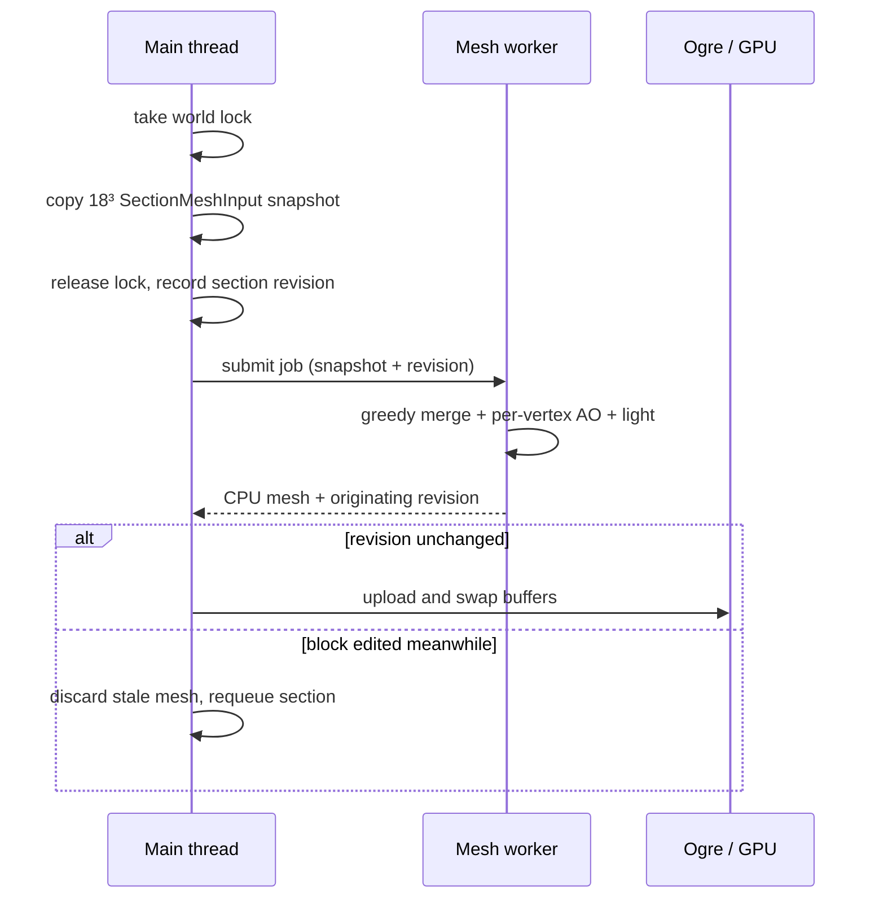
```mermaid
sequenceDiagram
    participant M as Main thread
    participant W as Mesh worker
    participant G as Ogre / GPU

    M->>M: take world lock
    M->>M: copy 18³ SectionMeshInput snapshot
    M->>M: release lock, record section revision
    M->>W: submit job (snapshot + revision)
    W->>W: greedy merge + per-vertex AO + light
    W-->>M: CPU mesh + originating revision
    alt revision unchanged
        M->>G: upload and swap buffers
    else block edited meanwhile
        M->>M: discard stale mesh, requeue section
    end
```

---

## Ten engineering practices worth a look

If you only read a few parts of this repository, read these.

| # | Practice | Where |
| --- | --- | --- |
| 1 | **Transactional world saves.** A same-directory candidate is written, durably flushed, re-read through the *real* format reader, and only then atomically swapped in. One failed candidate is kept for diagnosis; a failed save can never destroy the last good one. | [`World/Storage/`](src/HelloMine3D/World/Storage/) · [contract](docs/contracts/storage-transaction-contract-v1.md) |
| 2 | **Twelve save versions, no orphans.** `save v1→v12`, `terrain v1–v4` and `settings v1→v8` all migrate deterministically, with fixtures for every old version. A world permanently keeps the terrain identity it was created with — new generation features never backfill existing chunks. | [`WorldSave.h`](src/HelloMine3D/World/Storage/WorldSave.h) · [`TerrainGenerator.h`](src/HelloMine3D/World/Generation/Terrain/TerrainGenerator.h) |
| 3 | **Verified, bounded backups.** A strict manifest freezes every path, byte count and fingerprint; backup *and* restore candidates must pass the real readers before publication, and restore parks the previous primary in a `recovery.failed` directory instead of deleting it. | [`WorldBackup.cpp`](src/HelloMine3D/World/Storage/WorldBackup.cpp) · [contract](docs/contracts/world-backup-contract-v1.md) |
| 4 | **Off-lock meshing with revision validation.** The world lock is held only long enough to copy an 18³ neighbourhood; the greedy/AO build then runs with no world access at all, and any result carrying a stale section revision is discarded rather than overwriting a newer edit. | [`SectionMeshInput.h`](src/HelloMine3D/World/Chunk/SectionMeshInput.h) · [`ChunkMeshBuilder.cpp`](src/HelloMine3D/World/Chunk/ChunkMeshBuilder.cpp) |
| 5 | **Performance comparison that can say "incomparable".** Scene identity, schema, build configuration and final chunk residency are all part of the record; a mismatch yields `INCOMPARABLE` instead of a misleading pass, and thresholds only gate after a baseline has been explicitly approved. | [`compare_perf_baselines.ps1`](tools/compare_perf_baselines.ps1) · [`performance-contract-v1.json`](tools/performance-contract-v1.json) |
| 6 | **Crash diagnostics with no telemetry.** A local minidump plus a versioned, sanitized sidecar; offline mixed-stack symbolization against a separately archived PDB; a next-launch prompt the player can simply ignore. Nothing is uploaded and no absolute developer paths leak. | [`Diagnostics/`](src/HelloMine3D/Diagnostics/) · [contract](docs/contracts/crash-diagnostics-contract-v1.md) |
| 7 | **Packages validated from an isolated root.** The distribution is checked from a directory with no access to the source or build tree, including negative cases for missing and stale resources — so "it works on my machine" cannot pass the gate. | [`package_windows_release.ps1`](tools/package_windows_release.ps1) · [`validate_startup_errors.ps1`](tools/validate_startup_errors.ps1) |
| 8 | **One frozen contract per feature batch.** Fifty-five contract documents fix the data fields, defaults, migration path, failure semantics and exit conditions *before* implementation — then record the real measured numbers afterwards. | [`contracts/`](docs/contracts/) |
| 9 | **A ThreadSanitizer gate that proves itself first.** The script requires an isolated race probe to actually report and exit 66, then verifies native architecture and TSan runtime linkage and rejects suppressions, before the real loader-churn run is allowed to count. | [`verify_tsan.sh`](scripts/verify_tsan.sh) · [notes](docs/current/thread-sanitizer-validation.md) |
| 10 | **Strict data-driven content with startup preflight.** Blocks, recipes, tools, foods, smelting, enemies, objectives, audio, music and both locales are parsed strictly from `media/`; a missing, duplicate or malformed entry fails before Ogre is even constructed. | [`media/`](media/) · [`StartupResourcePreflight.cpp`](src/HelloMine3D/Ogre/StartupResourcePreflight.cpp) |

---

## What is in the game

| Area | Content |
| --- | --- |
| **World** | Streamed chunks, 6 biomes, caves with natural surface entrances, a mountain height domain, deterministic ore/plant/tree decorators, 3 structure types (waystone, ruin, raider camp) |
| **Progression** | 25 non-air block types, 24 recipes, 8 tools across pickaxe / weapon / axe / shovel classes, three tiers (wood → stone → iron), furnace smelting, 4 foods |
| **Combat** | 6 enemy definitions with melee and ranged profiles, wind-up and recovery windows, directional knockback, blocking, bounded transient projectiles, identity-bearing drops |
| **Structure** | 34 data-driven objectives with independent branch progress, a waystone victory loop, bounded post-victory trials, 3 difficulty profiles |
| **Presentation** | Vertex AO, an original 16×16 atlas with ecology tinting, directional fog and a parallax cloud layer, optional directional shadows (Off / Medium / High), optional bounded post-processing |
| **Product shell** | Main-menu world management with rename, backup-restore and recoverable delete; pause and versioned settings; remappable keys and mouse buttons; en-US / zh-CN at 411 keys each; sampled audio and streamed ambient music |

---

## Current status

Stage 11 (`P11-0` … `P11F`) closed the Windows engineering scope on 2026-08-31. The full gate
then passed at `832/832` world assertions in both configurations, six formal performance scenes
compare clean, both 1800-second soak profiles pass, and the 104-file package validates from an
isolated root.

Architecture Lab batches AL-A0 through AL-A6 and Track B Core B1-B6/B10 are complete. The B10
gate passes `920/920` world assertions in both configurations, a 1,800-second five-phase stress
run with zero failures, all six final Q1 comparisons, and a 104-entry clean package. C1 is also
complete: Chest/Furnace expose a minimal capability access boundary, both Debug and Release pass
`937/937`, and its 104-entry isolated package hashes to
`1618ACD7995FE5181169B0B46A5D4F479F63FA1CCB8B533B358ED694A3846EB6`. B7-B9, C2-C11,
Track D and Extended capabilities remain unapproved candidates.

This is a personal architecture-learning and showcase project, not a commercial product with an
external playtest panel. The game remains the proof vehicle: observable workflows are validated
by automation plus AI/Computer Use against a clean Release package. The first Computer Use
baseline is currently `NOT_RUN`; human fun, physical-device feel and subjective preference are
explicitly `NOT_CLAIMED`, rather than kept on an indefinite deferred list. No `1.0` tag has been
created.

See [`docs/current/todolist.md`](docs/current/todolist.md) for the authoritative current state, and
[`docs/reports/playability-release-candidate-report-2026-08-31.md`](docs/reports/playability-release-candidate-report-2026-08-31.md)
for the frozen engineering evidence. The active acceptance boundary is
[`docs/current/ai-assisted-gameplay-acceptance-v1.md`](docs/current/ai-assisted-gameplay-acceptance-v1.md).

---

## Project Layout

The project has been reorganized with the same broad shape as `HelloOgre3D`:

| Path | Responsibility |
| ---- | -------------- |
| `src/HelloMine3D/` | Game and engine source code. |
| `src/external/` | Small vendored libraries used directly by the build. |
| `media/` | Runtime assets: blocks, textures, shaders, and fonts. |
| `bin/` | Runtime configuration and generated executable. |
| `docs/` | Architecture notes and documentation images. |
| `scripts/` | Build, run, and debug helpers. |

| Document | Contents |
| -------- | -------- |
| [`docs/README.md`](docs/README.md) | Documentation map, authority rules and reading paths. Start here. |
| `docs/current/todolist.md` | Authoritative current state, approved work and evidence status. Start here. |
| `docs/current/architecture-lab-roadmap-v1.md` | Proposed long-term Architecture Lab capability catalogue and playable-carrier constraints. |
| `docs/current/ai-assisted-gameplay-acceptance-v1.md` | Active automation/AI/Computer Use acceptance boundary, scenarios and claim taxonomy. |
| `docs/current/validation-matrix.md` | Change-type to validation-command routing. |
| `docs/current/architecture.md` | Current code boundaries and the mapping from the original project layout. |
| `docs/current/runtime-validation.md` | Existing runtime evidence and its coverage limits. |

## Origins

Original challenge video: https://www.youtube.com/watch?v=Xq3isov6mZ8

Note: I continued to edit after the 7 days, however the version seen in the video is found here https://github.com/Hopson97/MineCraft-One-Week-Challenge/tree/eb01640580cc5ad403f6a8b9fb58af37e2f03f0c

And the "optimized" version can be found here: https://github.com/Hopson97/MineCraft-One-Week-Challenge/tree/792df07e9780b444be5290fd05a3c8598aacafc8 (~1 week later version)

There also is a version of this game with very good graphics, and things like a day/night cycle. However, it was causing rendering issues for many people. This version can be found here:
https://github.com/Hopson97/MineCraft-One-Week-Challenge/tree/aa50ad8077ef0e617a9cfc336bdb7db81c313017

## Other People's Projects

This was made in a week, as a challenge for a video. There do exist other, more mature and developed Minecraft clones written in C++.

MineTest here: https://github.com/minetest/minetest

## Historical SFML 3 Update

On November 2nd 2025, this project was updated to use SFML 3.0.0. The active
client has since migrated to Ogre 1.10; this note is retained only to identify
the older history.

To see the commit prior to this change, see: https://github.com/Hopson97/MineCraft-One-Week-Challenge/tree/fead1af708dca0518a6161fbac4c2673393d5ae0

## Building and Running

### Dependencies

The repo builds its local dependencies from vendored source under `src/external/`:

| Dependency | Expected local path |
| ---------- | ------------------- |
| Ogre 1.10 / GL3Plus | `src/Engine/ogre3d`, `src/Engine/ogre3d_glsupport`, `src/Engine/ogre3d_gl3plus` |
| FreeImage / FreeType / zlib / zzip | `src/Engine/ThirdParty/` |
| OIS | `src/external/ois` |
| Dear ImGui | `src/external/imgui/imgui.cpp` |
| Tracy Profiler 0.13.1 (optional) | `src/external/tracy/public/TracyClient.cpp` |
| GLM | `src/external/glm/glm/glm.hpp` |

Premake builds the Ogre, image, font, archive, OIS and ImGui dependency graph
directly from vendored source. `HelloMine3D` is the only client executable and
uses Ogre GL3Plus for rendering; there is no backend selection switch or
checked-in dependency binary tree.

Tracy instrumentation is disabled by default. Generate an instrumented client
only when profiling; `TRACY_ON_DEMAND` keeps capture inactive until a profiler
connects:

```sh
./xcode.sh --with-tracy
xcodebuild -workspace build/HelloMine3D.xcworkspace -scheme HelloMine3D \
  -configuration Release -arch x86_64 build
```

The equivalent generation flag is available to every Premake backend, and the
environment form is convenient for wrappers:

```sh
HELLOMINE3D_ENABLE_TRACY=1 ./xcode.sh
```

Run `bin/HelloMine3D`, open a Tracy 0.13.1-compatible profiler and connect to
the local client. The initial timeline names the main and chunk-loader threads,
marks each Ogre frame, and exposes frame delta, fixed ticks, simulation/world
updates, section upload, actor sync and chunk mesh build zones. When present,
`tools/tracy-viewer/tracy-profiler.exe` is the matching local Windows viewer;
`tools/tracy-viewer/VERSION.txt` records the expected version. Use a matching
Tracy profiler build on macOS.

### Build and Run

To generate and build with Premake/Make:

```sh
sh scripts/build.sh
```

To build and run in release mode, simply add the `release` suffix:

```sh
sh scripts/build.sh release
sh scripts/run.sh release
```

The executable is emitted to `bin/HelloMine3D`. Runtime paths are resolved from the project root,
so the binary can be launched from `bin/`, `build/Debug`, or the repository root.

To generate IDE project files without building:

```sh
sh scripts/premake.sh xcode4   # macOS/Xcode
sh scripts/premake.sh gmake    # Makefiles
```

On macOS you can use the HelloOgre3D-style shortcut:

```sh
./xcode.sh
```

On Windows, the maintained default is Visual Studio 2017 with the v141 toolset. Generate the
project directly with bundled Premake, then build `build/HelloMine3D.sln`. The generated project
files are written to `build/`, and the executable still outputs to `bin/HelloMine3D.exe`.

```powershell
tools\premake\premake5.exe --os=windows --file=premake/premake.lua vs2017
& "C:\Program Files (x86)\Microsoft Visual Studio\2017\Enterprise\MSBuild\15.0\Bin\MSBuild.exe" `
    build\HelloMine3D.sln /p:Configuration=Debug /p:Platform=x64 /m
```

### One-Command Build Verification

Use the platform wrapper below for clean project generation, Debug/Release
rebuilds and the thirteen headless targets expected before a change is
committed. The dedicated TSan row is additionally required after loader or
synchronization changes:

| Platform | Command | Required host tools |
| -------- | ------- | ------------------- |
| Windows | `powershell -NoProfile -ExecutionPolicy Bypass -File scripts\verify_build.ps1 -VisualStudioVersion 2017` | Visual Studio 2017 with **Desktop development with C++** and v141; Premake is bundled in `tools/`. Pass `-VisualStudioVersion 2022` only for an explicit v143 compatibility run. |
| Linux | `bash scripts/verify_build.sh` | A C++17 compiler, GNU Make, Premake 5 and the OpenGL/X11 development packages. |
| macOS / Make | `bash scripts/verify_build.sh` | Xcode command-line tools, GNU Make and Premake 5 (`brew install premake`). |
| macOS / Xcode | `bash scripts/verify_xcode.sh` | A graphical macOS session, Xcode command-line tools, Premake 5 and x86_64 execution support. |
| macOS / TSan | `bash scripts/verify_tsan.sh` | Native 64-bit macOS, Xcode/Apple Clang and Premake 5. |

The ordinary build wrappers stop at the first failed generation, compilation
or test step and print `[BUILD_VERIFY] status=PASS` only after both
configurations pass. The Xcode and TSan gates have their own terminal PASS
markers.
When no interactive OpenGL desktop is attached, pass `-SkipRealWindow`; the gate still runs both
headless configurations, validation-only startup, resources and packaging, while its summary
records the graphical crash/window flows as `DEFERRED` instead of claiming a PASS.
The macOS-native Xcode generator remains a separate validation path documented
in the project task list. A Windows host can still validate the generated
workspace contract without claiming a native build:

```powershell
powershell -NoProfile -ExecutionPolicy Bypass -File tools\validate_xcode_generation.ps1
```

This versioned preflight requires the exact 31-project workspace/on-disk
inventory: fourteen first-party targets and 17 libraries. It parses every generated
PBX group and cross-project reference, rejecting stale/missing projects,
duplicate children, one child in multiple groups, duplicate `ProjectRef`
entries and undeclared references. It also checks Cocoa/OIS/OSX sources,
platform paths/frameworks, the default-off Tracy boundary, foreign-platform
leakage and the native verifier contracts. It cannot replace `xcodebuild`.

On a real macOS host, `scripts/verify_xcode.sh` is the final native gate. It
generates Xcode projects, runs nine positive/negative graph fixtures, validates
the real 31-project graph, builds the client and thirteen tests in Debug and
Release, runs all 26 test executions, then performs both validation-only and
real-window 120-frame client probes. The real-window probes also verify that the
persisted player remains on the fixed surface fixture. The process prints
`[XCODE_VERIFY] status=PASS` only
after every step succeeds and keeps per-step logs under `build/`.

`scripts/verify_tsan.sh` separately regenerates the project, builds the real
world target as a native ThreadSanitizer binary, and runs all 346 assertions
including the concurrent V5 loader scenario. It rejects first-party sanitizer
suppressions, missing TSan linkage, any sanitizer report or incomplete runtime
summary. See `docs/current/thread-sanitizer-validation.md`.

### Runtime Configuration And State

`bin/config.txt` is a per-user runtime configuration and is intentionally not
tracked. The client creates it when missing with these defaults:

```text
settings_version 6
renderdistance 8
directionalshadowquality off
postprocessingquality off
fullscreen 0
windowsize 1280 720
fov 90
mousesensitivity 0.05
invertmousey 0
seed random
```

Deleting the file resets these settings on the next launch. The render
distance, fullscreen flag, window size, field of view, mouse sensitivity and
optional vertical-look inversion are read by the Ogre client. Set `seed` to an
integer to reproduce newly created worlds, or leave it as `random`; a saved
world's seed remains authoritative. The
`HELLOMINE3D_SEED` environment variable can still override the configured seed
for a new world during automated runs. Blank lines and `#` comments are
allowed. `bin/Mine.cfg`, `bin/MineResources.cfg` and `bin/resource-packs.txt`
are the repository-owned files in `bin/` and act as runtime templates.
Executables, logs, ImGui state, saves, crashes, captures and the legacy unused
`info.txt` are generated local state and remain ignored.

### Validation

The build produces the client plus thirteen test targets, all of which run headless:

```powershell
bin\HelloMine3DCoordinateTests.exe        # coordinate conversion
bin\HelloMine3DMeshDirtyTests.exe         # mesh dirty planner
bin\HelloMine3DSaveLoadSmoke.exe          # chunk serialization roundtrip
bin\HelloMine3DEntityLifecycleSmoke.exe   # actor lifecycle
bin\HelloMine3DWorldRuntimeSmoke.exe      # full world/actor/audio/objective/visual-settings stack, 937 assertions
bin\HelloMine3DSoak.exe                   # deterministic world stability schedule
bin\HelloMine3DResourcePackSmoke.exe      # resource resolver and frozen view
bin\HelloMine3DRecipeSmoke.exe            # strict startup recipe registry
bin\HelloMine3DWorldCatalogueSmoke.exe    # world identity/catalogue contract
bin\HelloMine3DStorageTransactionSmoke.exe # atomic save/failure recovery
bin\HelloMine3DWorldBackupSmoke.exe       # bounded backup/verified restore
bin\HelloMine3DOperationTimingSmoke.exe   # bounded Q2 phase/outcome summaries
bin\HelloMine3DCrashDiagnosticsSmoke.exe # H1 path/trigger/backend contract
```

Asset and data changes should also run the reference-aware asset check:

```sh
bash scripts/check_assets.sh
```

It validates registered block definitions and their named shape resources,
Ogre shader and texture references, the bundled font and audio definition,
resource locations, and the checked-in runtime templates. Non-cube block definitions use
`MeshType 1` plus `Shape <name>`; each `media/shapes/<name>.shape` file contains
one or more `Face` entries with 12 normalized vertex coordinates.

The client also has a deterministic validation-only startup that does not
create a render window:

```powershell
$env:HELLOMINE3D_VALIDATE_ONLY = "1"
$env:HELLOMINE3D_SEED = "20260809"
$env:HELLOMINE3D_PLAYER_POSITION = "264 96 8"
bin\HelloMine3D.exe
```

Two client-level smokes exercise the assembled game without stealing focus or the mouse:

```powershell
powershell -ExecutionPolicy Bypass -File tools\run_render_capture.ps1 -CaptureMs 4000,6000 -Seconds 12 -PlayerRotation "20 118.4 0"
powershell -ExecutionPolicy Bypass -File tools\run_perf_baseline.ps1 -WarmupMs 3000 -DurationMs 10000
powershell -ExecutionPolicy Bypass -File tools\compare_perf_baselines.ps1 -Baseline <accepted-run> -Candidate <candidate-run>
```

Pass `-WorldTime 6000` for deterministic noon or `-WorldTime 18000` for
deterministic midnight captures. One full day is 24,000 fixed simulation ticks.

On Windows, fatal startup and resource errors remain complete on stderr and are
also shown in a modal error dialog. The non-interactive regression is:

```powershell
powershell -ExecutionPolicy Bypass -File tools\validate_startup_errors.ps1
```

The startup resource inventory is generated from registered blocks and the
references in block, material and program files. Regenerate or verify the
checked-in manifest with:

```powershell
powershell -ExecutionPolicy Bypass -File tools\generate_resource_manifest.ps1
powershell -ExecutionPolicy Bypass -File tools\generate_resource_manifest.ps1 -Check
powershell -ExecutionPolicy Bypass -File tools\validate_resource_manifest.ps1
```

The last command also proves that a missing expected entry and an unreferenced
stale entry fail even when every resource file still exists.

Resource packs are enabled in priority order through `bin/resource-packs.txt`.
They may override only version-1 approved existing manifest entries and are
frozen at startup. Recipe, tool and audio definitions remain base-owned:

```powershell
powershell -ExecutionPolicy Bypass -File tools\validate_resource_packs.ps1
```

For long-lived world regression and a self-contained Windows Release package:

```powershell
powershell -ExecutionPolicy Bypass -File tools\run_world_soak.ps1 -DurationSeconds 1800 -Formal
powershell -ExecutionPolicy Bypass -File tools\validate_crash_diagnostics.ps1 -ExePath bin\HelloMine3D.exe
powershell -ExecutionPolicy Bypass -File tools\package_windows_release.ps1 -IncludePack example-stone
```

The crash command is destructive only to its isolated fixture process: it
expects the current Windows Release client to exit non-zero and writes one
local dump below `bin/crash_diagnostics_validation/`. Generated soak/crash
evidence, package directories and ZIPs stay under `bin/` and remain ignored.
See the corresponding contracts above for their storage boundary,
deterministic inventory and negative checks.
On a disconnected build session, both crash/package commands accept `-SkipRealWindow`; this keeps
the headless checks and explicitly defers every flow that requires an actual OpenGL window.

See `docs/current/runtime-validation.md` for what each layer covers.

## The Challenge

### Day One

End of day one commit: https://github.com/Hopson97/MineCraft-One-Week-Challenge/tree/44ace72573833796da05a97972be5765b05ce94f

The first day was spent setting up boilerplate code such as the game state/ game screen system, and the basic rendering engines, starting off with a mere quad.

The day was finished off by creating a first person camera.


End of day stats:

| Title                  | Data    |
| ---------------------- | ------- |
| Time programming Today | 3:21:51 |
| Lines of Code Today    | 829     |
| Total Time programming | 3:21:51 |
| Total Lines of Code    | 829     |

### Day Two

End of day two commit: https://github.com/Hopson97/MineCraft-One-Week-Challenge/tree/98055215f735335de80193221a30c0bb8586fba5

The second day was spent setting up the basic ChunkSection and various block classes.

I also worked out the coordinates for a cube, and thus created a cube renderer.

I finished up the day attempting to create a mesh builder for the chunk; however, this did not go well at all, and two had ended before I got it to work correctly.


End of day stats:

| Title                  | Data    |
| ---------------------- | ------- |
| Time programming Today | 4:16:07 |
| Lines of Code Today    | 732     |
| Total Time programming | 7:37:58 |
| Total Lines of Code    | 1561    |

### Day Three

End of day three commit: https://github.com/Hopson97/MineCraft-One-Week-Challenge/commit/78bd637581542576372d75cf7638f76381e933b4

To start the day off, I fixed the chunk drawing. Turns out I was telling OpenGL the indices were `GL_UNSIGNED_BYTE`, but they were actually `GL_UNSIGNED_INT`. This took 3 hours to work out...


Anyways, after this I got the game working with more chunks. I now have an area of 16x16 chunks, made out of chunk sections of 16x16x16 blocks.

To finish the day off, I got some naive block editing to work.


End of day stats:

| Title                  | Data     |
| ---------------------- | -------- |
| Time programming Today | 3:15:38  |
| Lines of Code Today    | 410      |
| Total Time programming | 10:53:36 |
| Total Lines of Code    | 1974     |

### Day 4

The first thing I did on day 4 was create a sky box using OpenGL cube maps.

After this, I started work on the world generation, eg adding height map and trees.


End of day stats:

| Title                  | Data     |
| ---------------------- | -------- |
| Time programming Today | 3:14:15  |
| Lines of Code Today    | 523      |
| Total Time programming | 14:07:51 |
| Total Lines of Code    | 2489     |

### Day 5

I started off the day by cleaning up some of the chunk code, and then proceeded to make the world infinite, but
I felt it was not needed, so I simply went back to a fixed-sized world.

I then added an item system. My implementation probably was not great for this, but it was my first time
at creating that sort of the thing.

Basically, when a player breaks a block, it gets added to their inventory. When they place a block, a block
is placed.

| Title                  | Data     |
| ---------------------- | -------- |
| Time programming Today | 2:54:14  |
| Lines of Code Today    | 560      |
| Total Time programming | 17:02:05 |
| Total Lines of Code    | 3049     |

### Day 6

Mostly optimizations, such as view-frustum culling and making the mesh building faster.

### Day 7

Focus on improving how it looks, eg adding directional lighting

Also implemented concurrency :)
