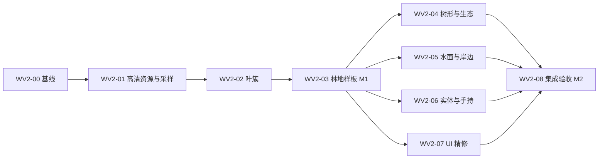

# 暖野视觉升级实施方案 v2

日期：2026-09-12。状态：**方案完成；WV2-00..03 已获后续授权并实施中，WV2-04..08 为 Planned**。

本方案承接本轮已交付的“暖野第一版”和 Miniw-Client 实机分析，供后续直接分批实施。
最初授权为编写方案；后续用户已明确要求开始首轮，实际进度见
[M1 实施记录](../reports/warm-wilderness-m1-implementation-2026-09-12.md)。
本文件不把其余运行时改造、T2+ 地形项目或 D2 自动转为已批准任务。
开始实施后，按用户实际授权连续推进适用批次，常规设计、修复和批次内验证不追加确认关卡。

2026-09-12 最新实机反馈：树冠改造已撤回，当前候选恢复旧版立方叶与树叶贴图，
保留其他材质升级。下文 WV2-02 是原方案及试验设计，不代表当前候选仍交付叶簇；
原 M1 的整体性能/玩法验收尚未完成，实际状态以实施记录为准。

## 1. 目标与依据

目标是让 HelloMine3D 从“配色改善的方块世界”提升为材质细腻、树冠蓬松、林地有层次、
水岸清楚、实体与界面风格统一的自然体素游戏。保留“暖野”的温暖、克制和清晰分面，
借鉴 Miniw-Client 的材质精度、叶簇轮廓与场景组织。

推荐路线：**先交付一个可正常游玩的林地样板，再扩展树形、水岸、实体和 UI。**
当前 Ogre/GL3Plus 可以承担这条路线；无需以换引擎、移植 Miniw 渲染器或大型后处理系统作为前置条件。

依据与声明边界：

| 来源 | 本轮已确认的事实 | 对方案的影响 |
| --- | --- | --- |
| [暖野方向稿](../reports/visual-direction-warm-wilderness-2026-09-10.md) | 用户选择自然温暖、柔和光照、精致体素和干净 UI；概念图是美术参考 | 继续这一方向，主菜单艺术图不作为游戏画面验收依据 |
| [暖野 v1 实施报告](../reports/warm-wilderness-implementation-2026-09-12.md) | 材质、地形光色和 UI 已接入实际运行；macOS 双配置及针对性性能验证完成 | v2 从已交付 v1 起步，不重复承诺已有功能 |
| [Miniw-Client 实机分析](../reports/minigame-visual-feasibility-2026-09-12.md) | 实际圆形树场景、128 像素自然贴图和角色资产；界面显示实时光影、水面反射、雾关闭 | 优先改善资产和场景构成；不能把其观感归因于昂贵特效 |
| 本项目源码 | 已有资源形状、生态材质选择、AO、方向阴影、水面、分部件实体和版本化生成 | 在现有运行路径上扩展，并保护存档与线程边界 |

Miniw 的 Metal 原型不在参考范围。其树形切换后的重载异常已记录在分析报告，方形树对照未完成。
两个项目的存档、机位和场景不同，本方案不声明画质或性能已经等同，也不承诺逐像素复刻。

### 1.1 起始版本

- 制定方案时仓库 HEAD：`a18ba59`；当时工作区包含尚未提交的暖野 v1 运行时与资产改动。仅记录 HEAD 不足以重建该基线。后续分批本地提交见 [M1 实施记录](../reports/warm-wilderness-m1-implementation-2026-09-12.md)，不改写该基线身份。
- 已交付包：`build/warm-visual-20260912/HelloMine3D-Warm-v1.app`。
- Release 程序 SHA-256：`42b867b3c062f305f6543e791c7cd2d1fd36c2ede64ac0afce067941771d018c`；包清单 107 项。
- 当前格式：world save v12、terrain generation v1–v5、settings v8；当前地形网格顶点 32 字节。
- v1 已有 macOS Debug/Release WorldRuntime 各 1014 项、ResourcePack 各 86 项及 MeshDirty 通过。
  这些是旧基线证据，不能填入未来 v2 的验证结果。
- 当前先以 macOS 开发与验收；新的 Windows 构建和 GPU 结果单独记录，不能由 macOS 推导。

WV2-00 必须冻结实际源码、资源与包身份，并保留工作区已有文件。后续若按用户授权提交，
只提交对应批次文件；本方案本身不要求自动提交、推送或打标签。

## 2. 美术目标与取舍

实施中修订（2026-09-12）：用户拒绝首个“柔化手绘材质 + 薄交叉叶片”候选，明确要求
“保留旧版清晰的方块质感，做更精细的升级”。本轮后续以精细像素材质、饱满树冠和清楚的
方块结构为准；叶簇使用有体积的外壳。下述自然环境题材保留，柔化与去方块化不再作为目标。

### 2.1 画面应该呈现什么

| 观察距离/状态 | 目标 | 不合格现象 |
| --- | --- | --- |
| 近处约 2–8 个方块 | 草叶、土粒、树皮、石纹可辨；亮暗块有组织；方块边界仍清楚 | 将 16 像素纹理放大后涂糊、均匀椒盐噪点、地面像布料 |
| 中景约 8–32 个方块 | 树冠形成松散叶簇；树干、林下空隙、草地能分层 | 所有树仍是相同的平顶方冠；透明叶片露出整齐十字骨架 |
| 远景约 32–128 个方块 | 树林合成稳定大色块；明暗、地貌轮廓和远雾分层 | 镜头移动时草地闪烁、树冠消失或出现棋盘色块 |
| 正午/背光 | 草、土、石、木、沙保持不同明度，阴面仍有体积 | 整片黄滤镜、树叶黑洞、暗面无 AO 层次 |
| 黄昏/夜间/洞内 | 暖光、冷环境色和危险可见性延续 v1；夜晚仍明确是夜晚 | 新材质自发光感、夜晚变白天、洞内无光却亮绿 |
| 正常玩法 | 目标、生命、物品、交互和命中反馈一眼可读 | 为展示风景隐藏必要反馈，或新增装饰长期遮挡视野 |

暖野的起始色票建议为草绿 `#879967`、深叶绿 `#526D49`、土褐 `#80634C`、
暖灰石 `#92938A`、浅沙 `#C7B98E`。这是美术选色起点，不能直接当作线性空间 shader 常量。
红黄叶可以作为局部季相式点缀；不要求复制 Miniw 的全局饱和度，也不引入季节模拟。

### 2.2 第一阶段必须做与后置内容

| 优先级 | 内容 | 原因 |
| --- | --- | --- |
| P0 | 自然材质母版、正确过滤与 mipmap、叶簇轮廓、林地样板、兼容回退 | 直接决定本轮参照中最明显的视觉差距 |
| P1 | 新世界树形与植被分布、水面/水岸材质、现有实体与手持工具资产 | 将单一好看场景扩展为正常探索体验 |
| P2 | UI 图标精修、细节动画、少量有实测收益的风动或水纹 | 在主体稳定后收尾 |
| 后续独立候选 | 新动物玩法、大型河网/侵蚀算法、季节、体积云、SSR、PBR 全套、远景替身系统 | 不作为本轮视觉升级的依赖；有具体收益再立项 |

## 3. 资源规格与构建链

### 3.1 材质清单

世界自然材质按 **128×128 原始母版、64×64 标准运行层**制作。128 运行层只用于清晰度与显存对照，
默认不暴露成新画质档位；是否值得发行由近景收益与性能决定。
保留当前 16 像素资源作为兼容路径。母版应重新设计细节，不能以插值放大现有 16 像素图作为完成标准。

第一组母版共 19 张，覆盖九类视觉用途：

| 用途 | 母版数 | 具体要求 |
| --- | ---: | --- |
| 草顶 | 3 | 主色一致、疏密不同，边缘可平铺；每张有不同细节，不能只旋转 |
| 草侧 | 2 | 上沿草根与草顶衔接，下部泥土方向明确；避免整块垂直条纹 |
| 泥土 | 2 | 小颗粒叠加少量团块；明度低于草顶与沙 |
| 岩石 | 2 | 宽缓色块与少量裂纹，避免所有石块呈同一条斜裂缝 |
| 树皮侧面 | 2 | 纵向生长感，保留中等尺度变化 |
| 木材切面 | 1 | 环纹清楚但不高对比靶心化 |
| 叶簇 | 3 | 独立叶团 Alpha，中心有体积，轮廓不形成方框；各 mip 保持覆盖率 |
| 沙 | 2 | 浅暖色、低对比，岸线与土/石可辨 |
| 高草 | 2 | 根部收束、顶部不齐，Alpha 无黑边；稀疏形状仍能远看 |

这些母版供 120 个既有语义槽位中的相关槽位复用与生态派生，不表示新增 19 个方块或物品。
未列入的矿物、功能块等先沿用可追溯的现有像素内容；报告逐项标明“重绘/派生/沿用”，不称全资产重制。
UI 暂用独立的现有图标图集，世界纹理升级不能改变物品坐标、名称和堆叠语义。

### 3.2 确定性资源流水线

1. 在 `docs/art-sources/` 保存母版、来源、生成提示或创作说明、许可证和 SHA-256。
2. 用可版本化清单记录语义名、源图裁剪、色彩空间、透明类别、生态派生、运行尺寸和过滤方式。
3. 构建脚本逐层生成纹理及 mip：颜色在正确空间过滤；透明边缘做颜色扩展，过滤时使用 Alpha 加权，
   再输出与最终采样约定一致的数据；禁止让透明像素中的黑色污染叶缘。
4. 对叶/高草做固定裁剪阈值下的覆盖率保持；保留底层小 mip 的视觉可辨性，避免整棵树远处消失。
5. 输出 64 标准资源、16 兼容资源、构建 manifest 与内容哈希；同输入重建必须得到约定一致的输出。
6. 校验全 120 语义、136 保留空槽、分面和 UI 地址、Alpha 类型、mip 尺寸、层数及非法覆盖。

现有入口是 [暖野图集构建器](../../tools/build_warm_texture_atlas.py)、
[可移植校验器](../../tools/validate_warm_texture_atlas.py) 和
[PowerShell 入口](../../tools/build_fs3_texture_atlas.ps1)。
扩展时保留 v1 的可重建路径，以版本化清单区分新输出；不把 v1 固定 256/16 的历史检查原地放宽成无约束。

## 4. 渲染实现决策

### 4.1 高清世界纹理：首选 Texture2DArray

首选让世界材质使用二维纹理数组，每个语义槽位占独立层，保留 16×16 的语义地址空间，
即 256 层、120 个有效地址。各层独立生成 mip，可以从根源上避免整张图集缩小时相邻材质串色。
现有 2D 图集继续服务兼容世界材质与 UI 图标。

本仓库 Ogre 已声明 `TEX_TYPE_2D_ARRAY`，GL3Plus 有数组纹理实现：
[OgreTexture.h](../../src/Engine/ogre3d/include/OgreTexture.h)、
[OgreGL3PlusTexture.cpp](../../src/Engine/ogre3d_gl3plus/src/OgreGL3PlusTexture.cpp)。
这证明可以开展有界集成验证，**不等于本项目的创建、逐 mip 上传、材质绑定和所有目标驱动已经通过**。
WV2-01 先验证这四个环节，再接完整资产；若有局部集成缺陷，仅修改相关引擎适配代码。

具体约束：

- GPU 层号由既有 tile 坐标推导为 `tileY * 16 + tileX`，保持现有语义地址、greedy merge key 和 32 字节顶点。
- 将语义坐标与实际纹理尺寸分开：旧 atlas 的半 texel 偏移不能直接套在数组层 UV 上；
  profile 必须明确采样类型与层尺寸，并验证 greedy 大面和资源 shape 两条 UV 路径。
- 在瓦片内重复 UV 上采样；用于 mip 选择的导数来自未 `fract` 的连续重复坐标，避免重复边界产生错误 LOD。
- 标准路径使用 mip 过滤，并按能力启用有上限的各向异性；兼容路径继续现有 nearest 行为。
- 统一地形、透明裁剪植物、带/不带阴影的采样接口；不能只改默认太阳下的地面 shader。
- 资源视图完成解析后，在注册方块和创建 GPU 材质前冻结 profile。格式升级应有明确版本，旧 v1 资源包仍可被识别。
- 数组能力缺失时选择完整兼容 profile；资源损坏或 shader 接口缺失按合同报错，不伪装成“显卡不支持”。
- 不直接给紧密排列的旧图集开启全图 mipmap。若数组路径确实无法交付，本批保留兼容版本并记录阻塞；
  单独带护边的 atlas 方案须完成尺寸/UV/逐瓦片 mip 设计后才可替代，不能临时只改过滤开关。

RGBA8 的理论纹理数据量（256 层，完整 mip，未含驱动开销）为：

| 每层边长 | 基础层 | 含完整 mip 约值 | 定位 |
| --- | ---: | ---: | --- |
| 64 | 4 MiB | 5.33 MiB | 标准运行目标 |
| 128 | 16 MiB | 21.33 MiB | 开发对照，收益成立后再考虑交付 |

只常驻一个世界细节 profile；分别记录加载峰值、兼容图集、UI 和新增实体资源，不能仅用上述理论数代替进程/GPU 观测。

### 4.2 叶簇：保留叶块真值，改变表现

当前 [OakLeaf.block](../../media/blocks/OakLeaf.block) 为方块网格、可碰撞、BlockId 5。
v2 保留其碰撞、选取、采集、掉落、光传播和存档身份。第一次交付采用**单元格内叶簇**：
每个叶单元采用六面候选壳，剔除内部接触面后为 1–6 个四边形，最多 12 个三角形；顶点始终处于 `[0,1]`。
密林性能实测后取消原型“补足四面”的内部重复绘制；相邻叶壳在格边界精确接合，孤立单元仍为完整六面体积。

实施要点：

- 通过明确的叶簇渲染类型和专用 cutout 材质接入 CPU mesh → Ogre 上传流程；不继承高草风动等无关行为。
- 从固定 seed 和世界坐标派生形态/旋转，包含负坐标稳定性；不消费玩法随机数，不随帧改变网格。
- 叶片双面可见、深度写入、Alpha 裁剪；裁剪阈值只影响叶材质，与玻璃/水的透明语义分开。
- 为完全内部叶单元设计保守省面规则，密林实测中检查透孔是否暴露规则空壳；不能为每个体积叶块无条件叠六面。
- 保留正常光照和有界叶簇暗部。现有资源形状入口只提供统一 `LIGHT_X` 合成光，不能宣称直接复用就等同立方体逐顶点 AO。
  必须明确新叶簇采样与遮蔽方式，并以亮处、林下、洞内和火把附近对照验证。
- 阴影投射同步使用叶 Alpha，避免蓬松树冠仍投出实心方块阴影；阴影 Off 仍须有足够体积感。
- 首轮不用跨格悬伸和每帧距离重建；先依靠正确 mip、内部省面和有界几何解决远景与性能。

理由是当前 [BlockShape](../../src/HelloMine3D/World/Block/BlockShape.cpp) 限制顶点范围，
[ChunkSectionRenderable](../../src/HelloMine3D/Ogre/ChunkSectionRenderable.cpp) 也约束 section 包围盒与顶点。
如果单元格内样板仍有明显切割感，后续再设计悬伸上限、包围盒膨胀、邻区依赖、剔除和阴影边界合同，
不能只放宽解析器来获得表面上的蓬松感。

### 4.3 光照与环境

延续 v1 的 AO、暖冷地形光色、天空/雾与方向阴影；先在阴影 Off、后处理 Off 下校准材质本色，
再检查 Medium/Off、High/On。避免通过加大饱和度、Bloom 或曝光掩盖材质问题。

颜色导入、纹理采样和最终输出要确认只有一次预期的色彩转换，新增 sRGB 采样不可与现有 toneGamma 重复补偿。
日光下主要调整明度关系、光色强度和叶背光可读性；夜间和大气强制回退继承已有边界。
第一阶段不增加离屏渲染目标或全新光照模型。

### 4.4 数据与所有权

资源解析与 profile 冻结发生在启动阶段；CPU mesh worker 只消费不可变 section 输入、形状与材质描述，
输出纯 CPU 网格。Ogre 所有者负责纹理/材质/缓冲创建、上传和销毁，World 与生成代码不依赖 Ogre。
新增叶/水输入沿用现有 revision、取消和迟到结果拒绝机制；不能为视觉细节旁路 chunk 生命周期。
风动若后续加入，优先由固定坐标与时间 uniform 驱动，不逐帧重建区块。

## 5. 树形与场景构成

叶簇只改变一个叶块的轮廓；整棵树的方冠还需要生成结构变化。首组新树形建议为：

| 形态 | 视觉构成 | 使用方式 |
| --- | --- | --- |
| 圆冠乔木 | 主冠收顶、局部缺口、树干可见 | 温带林主力 |
| 高窄乔木 | 高度明显增加、冠部偏窄 | 打破同高天际线 |
| 低矮疏冠树 | 冠层偏低且不对称 | 林缘、草地过渡 |
| 小型灌木团 | 低冠与空隙，控制阻路 | 少量地表层次，使用既有方块语义 |

先用现有木/叶方块完成 3–4 种轮廓，不因资产需求新增树种玩法、配方或物品。
颜色变化主要遵循生态区域和低频色块；禁止每个叶块独立高对比随机染色。
若希望“每棵树一个颜色”，须先解决树身份/派生数据来源，不能在没有持久语义的情况下假称已经支持。

分布上形成密林、林缘、空地的小尺度关系；使用确定性低频密度场，限制贴边同高重复。
同时约束每片区域的木材/树叶数量、树干间距、冠幅、路径阻挡和生成开销，避免美术调整改变早期资源经济。
具体高度/冠幅和密度区间在 WV2-04 修改前用 v5 样本统计冻结，不预填未经地形适配的随机数。

### 5.1 生成版本与旧世界

[TreeGenerator.cpp](../../src/HelloMine3D/World/Generation/Structures/TreeGenerator.cpp) 的树生成函数被现有群系复用。
不能直接改共享 `makeOakTree` 让所有版本产生新树，否则旧世界未探索区块也会改变。

- v1–v5 的生成分支与历史指纹保持；新树形/密度通过新生成版本接入，暂定 v6，实施时先确认版本号仍可用。
- 旧世界已保存区块不重生成；旧世界未探索区块继续使用它自己的历史生成版本。
- 新世界明确记录新版本；保存重开和不同区块生成顺序得到一致结构。
- 版本扩展优先沿用现有 save v12 中的生成版本字段；须检查序列化、范围验证和拒绝未知版本的实际行为后才能确定无需格式升级。
- 不把新版本交给旧程序继续写入。回退测试使用独立世界副本，保留原包及原存档。

河网拓扑、侵蚀和山体算法仍属于 T2+ 候选；本方案的树木装饰版本不自动承接这些项目。

## 6. 水面、实体与 UI

### 6.1 水面与岸边

先在已核实的干燥岸边做水面材质与可见河床，保留当前天空近似反射、Fresnel 和高光。
v1 名为 coast 的诊断机位实际落到水下，不能沿用其名称就当作干燥岸线验收。

水面分两步实施：

1. **表面一致性。** 校准沙、水底、浅水/深水色和透明度；审计波纹是否用世界坐标、区块边缘相位是否连续，
   分开处理顶面/侧面/底面和水下观察，限制高光闪点与岸边波浪穿插。
2. **真实局部水深。** 新增有界深度输入，使浅水露底、深水渐浓；缺少深度数据时显式使用稳定回退。
   当前 shader 的深浅取决于距离与法线，并没有真实水深；增加波纹不等于完成水深着色。

深度建议先封顶 8 个方块，只用于表现。由世界侧形成带 revision 的不可变输入，mesh worker 消费快照，
Ogre 只接收结果。现有 section halo 不能自动提供这段纵向数据；跨 section、未知/未加载底部、挖掘和流体变化的失效必须设计。
可优先复用水顶点当前未消费的 UV 通道，但应单独定义水网格语义并验证布局，不能占用已有光照或地形字段。
禁止在渲染帧扫描世界、强制加载河床或新增无上限的逐水格查询。

不在此批加入屏幕空间反射或新河网。河岸生成形状的后续调整必须走对应版本分支，不能混入水 shader 提交。

### 6.2 实体与手持工具

[OgreActorRenderer](../../src/HelloMine3D/Ogre/OgreActorRenderer.cpp) 已有分部件几何，
[EnemyPresentation](../../src/HelloMine3D/Actor/EnemyPresentation.h) 已有表现状态。
首批为现有敌人补 UV 与统一贴图，在已有部件和动作边界内改善轮廓、脸部、肢体与受击辨识。
动作继续来自固定 tick 的 ActorSnapshot，不由渲染器改变 AI、碰撞或战斗时序。

代表资产先做一个现有敌人、一把常用采集工具和一把现有武器；通过后扩展同类。
手持展示从当前 UI 贴图片段升级为带透视的三维前景物件，明确独立相机/深度与 UI 的叠放顺序，
沿用现有挥动、使用、命中和耐久反馈，不重新发出 Gameplay 事件。
检验不同 FOV、宽高比、UI 缩放、暂停/容器状态下的遮挡与收起行为。
动物、新 NPC 或复杂骨骼系统只在存在对应玩法任务时追加。

### 6.3 UI 收尾

保留 v1 干净的菜单、五槽快捷栏、短目标提示、暂停详情和 F1 诊断入口。
优先重绘高频工具/方块图标、统一选中框和耐久条，再考虑少量材质装饰。
世界高清材质与 UI 图标分开构建，图标应在实际小尺寸下清楚，而非直接截一块世界纹理。

制作和容器的重点是内容高度、常用动作可达和物品数量清楚。
v1 已避免文本溢出，但制作页仍需要滚动才能看到部分操作；本批应把当前配方/动作整理到稳定区域，
在较小窗口保留明确滚动和关闭入口，不靠无限缩字。
中英文、0.85/1.0/1.25 缩放均实际操作，不能仅凭一张主菜单图验收 UI。

## 7. 批次与交付顺序

工作量是相对范围：S 为局部工具/参数/资产整理，M 为跨少量运行模块，L 为涉及生成、快照或新表现路径。
不是固定工期；每批以可验证产物结束，不以改了多少文件或截图更鲜艳为完成标准。
下列文件触点中，`World/`、`Ogre/`、`Actor/`、`Item/` 和配置源码均相对于 `src/HelloMine3D/`；
`media/`、`tools/`、`docs/` 相对于仓库根。只修改实际需要的触点，不把清单当作必须重构的文件集合。

图中的分支表示依赖关系，默认实施顺序仍为 00→08；不要求同时修改共享资源或自动创建多个任务。
建议第一轮实施范围取 **WV2-00..03**，交付 M1；其余列为后续完整路线。

### WV2-00：冻结基线与样本（S）

**输入：** 当前暖野 v1 源码、资源、干净包和本轮两份分析报告。

**任务：** 冻结文件哈希和构建身份；验证可重建；建立 §8 的机位/世界副本/正常操作路线；
在当前机器采集 v1 三档新基线；记录全部启用设置、物理分辨率和后台干扰。
先核实干岸机位和密林压力点；把 v5 存档对照与未来新版本生成样本分开。

**触点：** [capture_visual_macos.py](../../tools/capture_visual_macos.py)、
[compare_warm_visual_performance.py](../../tools/compare_warm_visual_performance.py)、
[验证矩阵](validation-matrix.md)；新建本批场景 manifest、报告和 v2 合同。

**交付/退出：** 基线可启动、同一存档可重开、原图/帧时/哈希齐全；每个待验证值有来源。
未找到岸线就继续选择机位，不修改世界来伪造旧版对照。文档和采样完成后才能调新参数。

### WV2-01：高清自然材质与采样路径（M）

**输入：** WV2-00 冻结基线；19 张母版规格。

**任务：** 先用少量诊断层验证数组创建、逐 mip 上传、shader 和能力回退；再接入完整语义映射与首组母版。
实现版本化资源配置与构建校验，保留 v1 资源包路径和 UI 图集；校准一次色彩转换。

**触点：** `tools/build_warm_texture_atlas.py`、`tools/validate_warm_texture_atlas.py`、
`World/Block/TerrainMaterialProfile.*`、`World/Block/TerrainAppearance.*`、
`Ogre/OgreBootstrap.cpp`、`media/ogre/HelloMine3D.program`、地形/阴影 shader、资源清单。
新增数组资源描述或适配文件按本批合同命名；这些是未来文件，尚不存在。

**检查：** 120 地址与分面、32 字节顶点、greedy UV、各 mip 边缘、缺层/错尺寸/错接口负例；
Debug/Release 客户端、ResourcePack、MeshDirty；三档真实 GPU 启动与移动观察。

**交付/退出：** 地面近看有细节、移动远看无明显串色；标准/兼容路径均能正常进世界；
输出完整新资源和重建记录，累计性能守住 §9。只有 128 对照好看而 64 不达标时，本批尚未完成。

### WV2-02：叶簇渲染与阴影（M–L）

**输入：** 标准材质路径和叶簇母版；固定 v5 林地。

**任务：** 单元格内叶簇、坐标稳定旋转、专用裁剪材质、有界光照/暗部、内部省面、Alpha 阴影；
保留低细节立方叶回退。先静态样板，再密林与区块边缘。

**触点：** `World/Block/BlockShape.*`、`World/Block/TerrainAppearance.*`、`World/Chunk/ChunkMeshBuilder.*`、
`World/Chunk/SectionMeshInput.*`、`Ogre/ChunkSectionRenderable.*`、`Ogre/OgreBootstrap.cpp`、
`media/blocks/OakLeaf.block`；新增叶 shape/材质/shader 资源及 manifest 项。

**检查：** 正负坐标和生成次序一致；越界/无效形状拒绝；跨 section 剔除、邻块移除、卸载重载、
林下/夜间/火把、阴影 Off/On；碰撞/选取/采集不变；密林几何、draw call 和帧时。

**交付/退出：** 树冠轮廓能看出叶簇，转头时无消失、方框或明显十字面；无越界与透明排序依赖；
预算不满足时先减少内部面和覆盖重叠，再收窄单簇复杂度，不修改树叶真值来凑性能。

### WV2-03：林地样板与首个可玩交付 M1（M）

**输入：** 01/02 的标准路径及兼容回退。

**任务：** 在同一 v5 林地完成草/土/石/木/叶/沙的整体色彩、光色和层次标定；
从主菜单走完创建/载入、移动观察、采集、暂停、保存重开。比较正午、黄昏、夜晚和岩地。
把标准/兼容选择接入设置：与阴影及后处理独立；涉及冻结资源时明确“重启生效”，不半途改全局 profile。
新增持久选项时使用下一个设置版本（当前预计 v9），迁移保留原语言、缩放、阴影和后处理偏好。

**触点：** 环境材质参数、`Ogre/OgreBootstrap.cpp`、`Ogre/OgreUserInterface.cpp`、`Config.h`、`RuntimeConfig.cpp`、
中英文文本、资源包/UI 回归。

**检查：** 完整受影响自动门禁、三档/三轮累计性能、正常菜单与采集操作、设置重启一致性、
兼容模式和强制能力回退；不把诊断直入场景写成正常操作完成。

**交付/退出：** 干净 macOS 包、六组以上固定世界原图、动态观察记录、性能 JSON、资源来源和限制。
M1 必须已能在正常运行中体验材质和叶簇；若仍只能展示孤立测试场景，则保持未完成。
人类审美反馈另记，不以实施者的“更好看”冒充人类审美通过。

### WV2-04：树形与生态装饰新版本（L）

**输入：** M1；v1–v5 兼容指纹、v5 木材/冠幅/密度统计。

**任务：** 实现 3–4 种树冠轮廓、低频密度与林缘过渡；通过新生成版本 dispatch，保留历史分支。
检查跨块树结构、生成顺序、出生点可达性与资源供给；新样本必须来自真实新世界流程。

**触点：** `World/Generation/Structures/TreeGenerator.*`、
`World/Generation/Terrain/ClassicOverWorldGenerator.*`、生成版本定义与保存读取、
`World/Storage/WorldSave.*`（仅实际需要时）、WorldRuntime 及
[地形验证器](../../tools/validate_terrain_foundation.py)。

**检查：** 历史各版本指纹、新版本多 seed/负坐标/区块顺序、版本保存重开、旧世界远处新块、
木材数量分布、阻路与生成耗时；既有场景性能与新密林压力分开报告。

**交付/退出：** 新版本世界看得出不同树形与空地关系，旧世界数据和未来生成不变；
记录所有旧指纹比较与新版本统计。回退时回到旧包及独立旧世界，不降写新版本存档。

### WV2-05：水面与岸边（M–L）

**输入：** M1、已验证干岸样本；不依赖完成新河网。

**任务：** 先完成表面一致性，再实现有界水深快照与着色；连通浅水、深水、岸边、侧面、水下表现。
可增加低对比水纹，保持坐标相位连续。与树形新版本共享场景时分别标记生成与着色贡献。

**触点：** `media/ogre/HelloMine3DWater.vert` / `.frag`、`Ogre/OgreBootstrap.cpp`、
`World/Chunk/SectionMeshInput.*`、`World/Chunk/ChunkMeshBuilder.*` 和必要的世界侧快照生产入口。

**检查：** 不加载未知区块获取水深；水下/岸边/顶侧面、跨 section、挖底/填底/水变化、
未知底部回退、保存重开、失效重建和成本上限；shader 负例与 MeshDirty。

**交付/退出：** 岸上能辨浅深与河床，水下无异常亮底和侧面接缝，水面移动观察无周期断裂；
物理/游泳语义不变。只完成表面色调时可记录子项完成，但不能将水深部分标为 PASS。

### WV2-06：现有实体与三维手持（M–L）

**输入：** M1 的颜色与材质规范；既有敌人和工具行为合同。

**任务：** 一个敌人＋常用工具＋武器样板，扩展 UV/贴图与前景展示；通过后覆盖本批指定的现有资产。
保持部件数、死亡/受击表现和固定 tick 驱动边界，新增资源预算独立记录。

**触点：** `Ogre/OgreActorRenderer.*`、`Actor/EnemyPresentation.h`、
`Ogre/OgreUserInterface.cpp` 中手持绘制入口；新增前景 renderer/模型/材质文件以实际需要为准。

**检查：** 空闲、移动、攻击、命中、死亡及数量压力；手持换物、空手、使用、耐久、不同 FOV、
窗口比例、暂停/制作/容器；无新增或重复战斗事件，无 UI 深度遮挡。

**交付/退出：** 现有角色/工具在正常玩法中与环境同风格，动作和命中反馈保持可读；
资产缺失要被资源检查捕获；不靠新增动物或玩法掩盖现有资产未完成。

### WV2-07：UI 图标与交互布局精修（M）

**输入：** M1 与已完成的实体/工具视觉规范；如 06 尚未落地，先完成布局再统一图标。

**任务：** 高使用频率图标、快捷栏、耐久/数量可读性；制作页常用动作区域、容器列表与关闭入口；
保持短目标/暂停详情/F1 的信息层级。

**触点：** `Ogre/OgreUserInterface.cpp`、`Item/Material.cpp` 的图标映射（仅资源地址需要时）、
`media/text/en-US.text`、`media/text/zh-CN.text`、图标构建与资源清单。

**检查：** 两语言×三缩放；主菜单、Worlds、设置、暂停、HUD、制作、容器实际点击、滚动和退出；
长名称、最大数量、禁用动作、状态/字幕并存。保持已知 UI 行为和物品身份。

**交付/退出：** 无截字/重叠/不可达动作；风格统一且正常反馈完整；记录诊断夹具与正常物品操作的证据区别。

### WV2-08：集成验收与完整交付 M2（M）

**输入：** 所有纳入本次实施范围的批次成果；未纳入内容保持明确候选状态。

**任务：** 从最终源码生成 Debug/Release；运行适用组成式门禁；用最终包完成固定原图、性能、
正常玩法和保存重开；整理平台差异、失败、来源、设置迁移和回退说明。

**触点：** [验证矩阵](validation-matrix.md)、[构建入口](../../README.md)、
[macOS 包工具](../../tools/package_macos_release.py)、[运行回归](render-regression-smoke.md)、
本计划和待办账本。

**交付/退出：** 最终可执行包与 manifest、实施报告、全部验收项状态、原始性能/窗口证据、
可重建资产、已知缺项。画面证据必须来自这个包；未运行的平台与人类体验分别保留 NOT_RUN / NOT_CLAIMED。
M1 可以作为独立已完成交付；M2 不能在 04–07 仍属本次承诺但未完成时提前宣告完成。

## 8. 场景与交互验收清单

每个场景记录 seed、生成版本/存档哈希、坐标与姿态、时间、天气/环境、FOV、RD、
逻辑/物理分辨率、语言/缩放、画质、包哈希、输入方式。WV2-00 先填写真实值，未知值不能猜测。

| 场景 | 检查内容 | 证据方式 |
| --- | --- | --- |
| S01 固定 v5 林地 | 材质、叶簇、阴影与整体色彩 | 同存档同机位，正午/黄昏/夜间原图；5s/10s 原始采集 |
| S02 密林与林下 | Alpha 覆盖、内部叶面、暗部、转头稳定性 | 固定帧时采样＋短段正常转头/行走；记录叶网格与 draw call |
| S03 草地/林缘 | 重复纹理、远景闪烁、色块过渡 | 前进/后退/斜视；静图不足以判定闪烁 |
| S04 岩地/山坡 | 草土石比例、远雾、阴影缝 | 与 v1 同机位；新版本地貌另列 |
| S05 干岸/浅水/深水 | 水底、岸边相位、透明度、侧面 | 已核实岸上视点，再记录下水与回岸 |
| S06 洞内/火把/夜间 | 无光暗部、局部照明、叶/实体亮度 | 正常点光源和环境对照；保留大气回退负例 |
| S07 区块边缘与流送 | 叶冠剔除、重复出现、迟到上传、稳定性 | 固定流送路线，覆盖负坐标与返回重载 |
| S08 新版本生态 | 树形、密度、资源分布与顺序确定性 | 多 seed 统计＋真实新建世界；与旧版外观 A/B 分栏 |
| S09 实体/手持 | 动作、命中、死亡、视野占用 | 正常操作；若用召唤/装备夹具单独标明 |
| S10 UI | 七类主要页面，两语言×三缩放 | 每组合原图＋实际点击/滚动；不只检查默认页 |

最小正常操作链：主菜单 → 创建或载入隔离世界 → 看近处和远处 → 采集/换物 → 制作/容器 →
暂停/设置 → 保存回菜单 → 重启再载入。容器转移和战斗仅在对应改动批次加入必要场景。
严格 AI-01..AI-08 与人类审美仍按[现行验收规范](ai-assisted-gameplay-acceptance-v1.md)独立声明，
开发者固定机位诊断不替代正常玩法或独立验收。

应用启动使用核对过 manifest 的隔离副本。重载/窗口失联后先重新核对 PID、包路径和运行目录；
不能假设工具重新绑定仍继承此前临时参数，也不能继续操作落入默认用户目录的进程。
这是一条本轮实机观察得到的采集可靠性要求，不是追加用户审批步骤。

## 9. 性能预算与故障处理

以下为建议在 WV2-00 冻结的实施护栏，尚无 v2 测量结果。门槛在改动前确定，失败后不为凑 PASS 放宽。

### 9.1 帧时与场景

- 使用 v1 作为累计基准；每批同时观察相对上批的变化，防止每批各增加 10% 后累积失控。
- 固定 1280×720 逻辑窗口，记录实际 Retina 像素；FOV90、RD8、相同世界真值。
- 阴影/后处理 Off/Off、Medium/Off、High/On 各三轮，5 秒预热、30 秒采样。
- 每档三轮 P95 和 P99 的中位数均 ≤ 同机器新采 v1 的 110%。密林样本也建立自己的三轮对应基线，
  不能用稀疏林地的预算掩盖密林退化。
- 保留每轮、最大帧时和 >33/50/100ms 卡顿次数；中位数通过不代表没有卡顿。
- 新版生成改变几何时，固定旧存档性能和新生成压力分别报告；不得宣称两者几何等价。
- 追加一次相关流送路线验证 mesh 构建/上传与队列；只有新失败、共享机制变化或未解决疑点才扩大到长期压力。

历史 v1 参考中位数为 Off/Off `11.889/12.278ms`、Medium/Off `10.481/11.197ms`、
High/On `10.121/23.424ms`（P95/P99）。新实施优先重采 v1，不能直接跨日期/后台负载据此判新版本 PASS。

### 9.2 资源与几何

| 项目 | 首轮目标护栏 | 测量与处理 |
| --- | --- | --- |
| 顶点布局 | 地形保持 32 字节 | 检查 producer、upload 和声明一致；水 UV 扩展不改变其他网格含义 |
| 单叶簇 | 六面候选壳，剔除内部接触面后 1–6 quads，上限 12 triangles | 内部省面；双面材质不额外复制整套背面几何 |
| 密林常驻 mesh 字节 | 同场景 v1 的 ≤135% | 这是总量护栏，单叶簇达标不能替代；超限优先减少不可见覆盖 |
| 第一阶段新增纹理常驻数据 | 64 标准路径相对 v1 ≤16 MiB | 统计世界/叶资源和兼容保留项；记录加载峰值与驱动测量限制 |
| 水深取样 | 最大 8 格、无强制加载、输入大小有界 | 记录生产和失效耗时；未知底部使用回退 |
| 每帧世界访问 | 不新增渲染线程世界查询 | CPU 快照与 revision 检查，GPU 资源只由 Ogre 所有者操作 |

后续实体/UI 批次在实现前单列增量资产预算，继续守住累计帧时护栏，不把 M1 的纹理预算当作全项目最终显存承诺。
若平台无法提供可靠 GPU resident 计数，记录实际纹理格式/层/mip 的计算量及可得进程数据，并说明未测项。

### 9.3 降级与回退

标准视觉为 64 层纹理＋叶簇；兼容视觉为现有 16 像素采样＋方块叶。阴影和后处理仍独立选择。
切换需要重新创建冻结资源时，走明确重启流程并保留用户原设置。

标准路径失败时，先定位 CPU mesh、GPU 透明覆盖、纹理过滤或上传中的瓶颈，再优化对应环节。
不要删测试、删除不利样本、减少正常世界内容或擅改分辨率来换 PASS。
兼容模式通过只证明兼容路径可用，不代表标准模式已经达到本方案目标。

## 10. 验证映射与实施交接

| 变更 | 必要验证 | 扩大验证的触发 |
| --- | --- | --- |
| 本次方案文档 | 链接存在、状态准确、diff 格式 | 无需构建或启动游戏 |
| 资源/数组采样 | 资源构建与坏包负例、ResourcePack、实际 GPU shader、相关双配置客户端 | 通用资源解析/启动路径变化时加入对应完整启动负例 |
| 叶/水网格 | MeshDirty、边界/失效用例、布局和快照检查、画面与相关性能 | residency/scheduler/共享光照变化时加入对应架构回归 |
| 生成版本 | 历史指纹、新版本统计、保存重开和 WorldRuntime 双配置 | 通用存储或世界生命周期变化时执行相应完整组成式门禁 |
| UI/设置/实体 | 对应行为检查、双语三缩放、持久化/正常交互 | 输入基础设施或 Gameplay 变化时加入该模块完整回归 |
| 最终 M1/M2 | 最终包身份、适用完整自动门禁、性能、真实窗口、保存重开 | 未解决异常继续调查，按实际证据分项判定 |

每批报告应包含：输入版本、最终差异、资产来源、构建配置、包与存档哈希、命令/日志、
原图/动态观察、每轮性能、失败及修正、兼容结果和未执行项。
沿用[迭代报告模板](iteration-report-template.md)和[执行流程](agent-workflow.md)，不预建大量空报告。
运行时改动前补读对应架构章节与适用合同；新语义用新合同说明，历史 v1 合同与报告保留原结论。

后续实施的第一条可执行任务为：

> 从 WV2-00 开始，以已交付暖野 v1 为实际基线，冻结输入与场景，实施 WV2-01..03，
> 完成 64 像素自然材质、独立 mip 采样、单元格内叶簇和正常可玩的林地样板，
> 按本方案交付干净 macOS 包、累计性能与正常操作证据。树形生成新版本、水面、实体和 UI 后续批次按实际授权进入。

这段首轮范围已获后续用户授权，按当前账本和 M1 实施记录推进；04–08 仍待实际授权。
