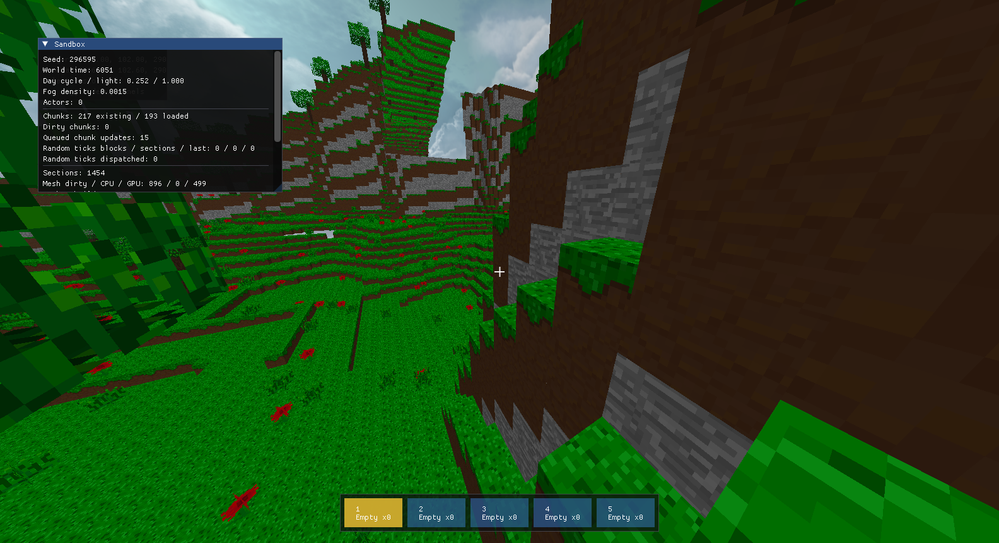
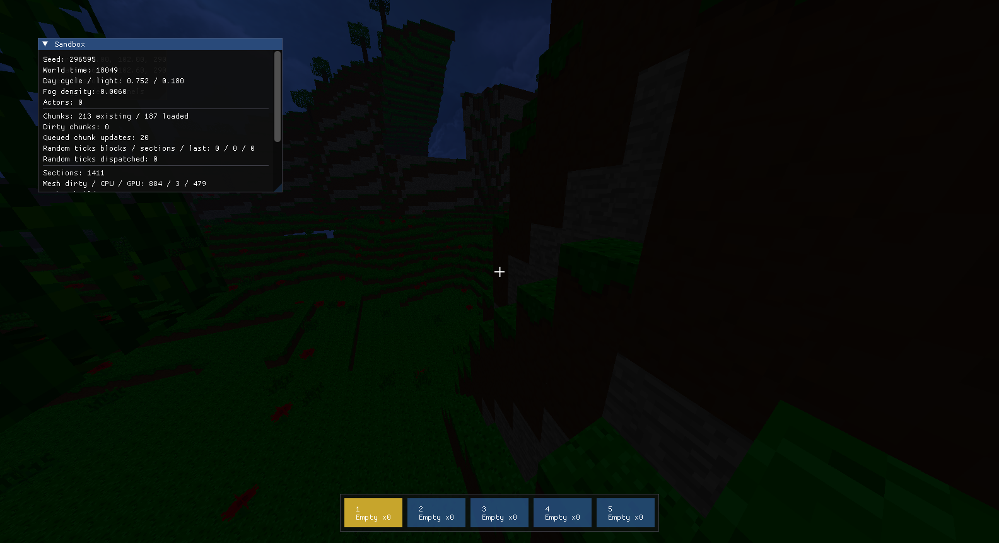

# Render Regression Smoke

This document records the July 2026 fix for the pure-blue runtime render
regression and the non-intrusive screenshot smoke path used to validate it.

## Problem

The game window could clear to the sky color and show no terrain. Older
reference screenshots under `docs/screenshots/` still showed terrain correctly,
so the issue was in the current runtime render path rather than the saved
reference images.

The root cause was the chunk submit condition in
`src/HelloMine3D/Renderer/RenderMaster.cpp`. `RenderMaster::drawChunk()` checked
`ChunkMesh::faces > 0`, but `ChunkSection::bufferMesh()` uploads mesh data to
OpenGL and then clears the client-side mesh data. After that upload,
`faces` can be zero even though the GPU model has valid indices, so the section
was skipped and only the clear/sky color remained visible.

## Historical Fix

The original SFML/OpenGL path was stabilized by these changes before it was
removed in E5. The table is retained as regression history; these files are no
longer part of the current client.

| Area | File | Fix |
| ---- | ---- | --- |
| Chunk submit | `src/HelloMine3D/Renderer/RenderMaster.cpp` | Submit solid/water/flora meshes based on `ChunkMesh::getModel().getIndicesCount() > 0` instead of the cleared CPU face count. |
| Render order | `src/HelloMine3D/Renderer/RenderMaster.cpp` | Render skybox before chunk passes with depth writes disabled for the skybox. |
| Texture state | `src/HelloMine3D/Renderer/WaterRenderer.cpp`, `src/HelloMine3D/Renderer/FloraRenderer.cpp` | Bind the block texture atlas in water/flora passes so previous GL texture state cannot leak into those passes. |
| GPU buffer cleanup | `src/HelloMine3D/Renderer/Model.cpp` | Track EBO handles in `m_buffers` so model cleanup deletes them. |
| Shader time | `src/HelloMine3D/Main.cpp` | Advance `g_timeElapsed` each frame so animated render passes receive time. |

## Screenshot Smoke

Use the runtime readback capture mode by default. Ogre writes the render target
through `RenderWindow::writeContentsToFile`; it does not use desktop
`CopyFromScreen`, so occluded windows do not capture the wrong application.

Command:

```powershell
powershell -ExecutionPolicy Bypass -File tools\run_render_capture.ps1 -StopExisting -CaptureMs 4000,6000 -Seconds 8 -PlayerRotation "20 118.4 0" -SpawnValidationActors
```

The script always starts `bin\HelloMine3D.exe`, the sole Ogre client. Actual
PNG validation requires a hardware-accelerated OpenGL 3+ desktop.

W1 day/night comparison uses the same seed, position and rotation while only
changing the world-time automation override:

```powershell
powershell -ExecutionPolicy Bypass -File tools\run_render_capture.ps1 -StopExisting -Seed 296595 -WorldTime 6000 -PlayerPosition "2766 102 2905" -PlayerRotation "20 118.4 0" -ShowDebugInfo
powershell -ExecutionPolicy Bypass -File tools\run_render_capture.ps1 -StopExisting -Seed 296595 -WorldTime 18000 -PlayerPosition "2766 102 2905" -PlayerRotation "20 118.4 0" -ShowDebugInfo
```

W1 hardware evidence (GTX 1050 Ti / OpenGL 4.6, 2026-08-13):

| Time | Tracked image | Debug panel | Sampled mean luma | SHA-256 |
| ---- | ------------- | ----------- | ----------------: | ------- |
| Noon (`6000`) | `docs/screenshots/validation-day.png` | cycle `0.252`, light `1.000`, fog `0.0015` | `56.096` | `1CF5A419553E37A750027F09B64C9B756035EAA54ED76A93E7C2AB82155D3EB7` |
| Midnight (`18000`) | `docs/screenshots/validation-night.png` | cycle `0.752`, light `0.180`, fog `0.0060` | `12.993` | `848078401B68E5EA9601DF06FAE4EC0779A41A3D03BD33FF364C241448FB60FF` |

Both captures are `1584x861`, show the same terrain and camera framing, and
pass the runtime PNG completeness check. The first hardware attempt exposed a
scene-independent startup bug: when no water mesh existed, the water material
had not yet been loaded before environment parameters were applied. The
runtime now explicitly loads each environment material before selecting its
technique, so absent water, transparent and actor layers cannot abort startup.





Expected behavior:

1. The script starts `bin\HelloMine3D.exe`.
2. The window is shown with `SW_SHOWNOACTIVATE` / `SWP_NOACTIVATE`.
3. Runtime capture mode disables player input and block interaction so the run
   does not warp the mouse.
4. The process writes `new_04000ms.png` and `new_06000ms.png` under
   `bin\render_capture_<runId>\`.
5. The process exits automatically after the requested captures.

Pass condition:

- The script prints `[RENDER_CAPTURE] status=PASS`.
- The output PNG files are non-empty.
- The images show terrain blocks and textures, a green mob cube and an amber
  dropped-item cube, not a solid blue or black frame.

## Last Hardware-Backed Run (Pre-E5)

Last verified command output:

```text
[RENDER_CAPTURE] runId=20260807190230074-46036
[RENDER_CAPTURE] capturesMs=4000,6000 seconds=12 prefix=new mode=RuntimeReadback noActivate=true
[RENDER_CAPTURE] seed=296595
[RENDER_CAPTURE] playerPosition=2766 102 2905
[RENDER_CAPTURE] playerRotation=20 118.4 0
[RENDER_CAPTURE] captured E:\Workspace\MineCraft3D\bin\render_capture_20260807190230074-46036\new_04000ms.png
[RENDER_CAPTURE] captured E:\Workspace\MineCraft3D\bin\render_capture_20260807190230074-46036\new_06000ms.png
[RENDER_CAPTURE] status=PASS outputDir=E:\Workspace\MineCraft3D\bin\render_capture_20260807190230074-46036
```

Verified images:

- `bin/render_capture_20260807190230074-46036/new_04000ms.png`
- `bin/render_capture_20260807190230074-46036/new_06000ms.png`

Both images show visible terrain with grass, dirt, stone and sand textures,
water, flora (tall grass and roses), and sky. No pure-blue or black frame.

## Capture Polling Race Regression

Runtime capture intentionally exits immediately after writing its final PNG.
The script formerly checked `HasExited` before checking the expected files, so
a clean exit between polling iterations could be reported as a failure even
when both PNGs were already complete.

The polling path now treats structurally complete PNG files as the primary
completion signal. It verifies the PNG signature, every declared chunk
boundary and the terminal `IEND` chunk before stopping the client; a non-empty
partial write is still pending. If a clean process exit is observed while
files are pending, it allows a two-second filesystem-visibility grace period;
non-zero exits, missing/empty/incomplete files and timeouts still fail.
Relative output/save paths are normalized against the repository root so the
script and the client cannot observe different working-directory-relative
locations. Once `HasExited` becomes true, the script waits for the process
handle to finish before reading `ExitCode`. The native handle is primed as
soon as `Start-Process` returns because Windows PowerShell 5 otherwise leaves
both `Handle` and `ExitCode` empty when the runtime exits before their first
access. This path has a GPU-independent regression command:

```powershell
powershell -NoProfile -ExecutionPolicy Bypass -File tools\run_render_capture.ps1 -ValidateCapturePolling
```

It first rejects a truncated non-empty PNG, then runs the former
exit-before-poll state ten times while each writer transitions from a partial
PNG to a complete PNG. It must finish with:

```text
[RENDER_CAPTURE_POLLING] runs=10 status=PASS
```

The 2026-08-12 Windows run exposed the second race with a 40 KB PNG whose
`IDAT` chunk was truncated when the script stopped the client, followed by a
Windows PowerShell 5 handle race for the fast clean exit. The strengthened
polling regression passes all ten iterations. A GTX 1050 Ti / OpenGL 4.6 run
then completed ten consecutive runtime captures; every PNG was structurally
accepted by the script and independently decoded by ffmpeg (46,343-49,604
bytes). Final summary: `[RENDER_CAPTURE_HARDWARE] runs=10 status=PASS`.

Earlier verified run, kept for comparison:
`bin/render_capture_20260707173412631-53208` (recorded while the repository
still lived at `E:\Workspace\MineCraft`).

## L1 Sunlight Hardware Capture

The 2026-08-12 L1 validation pinned seed `20260809`, player position
`264 96 8`, and rotation `20 118.4 0`, then captured:

```text
bin/render_capture_l1_surface_20260812/new_01500ms.png
```

The GTX 1050 Ti / OpenGL 4.6 runtime wrote a structurally complete PNG that
also decoded without errors through ffmpeg. The image shows bright open
terrain and visibly darker faces under opaque tree cover, while retaining the
terrain atlas, flora, debug panels and selected-block outline. This closes the
visual half of L1; the matching headless assertions cover exact sunlight
values, halo propagation, greedy-mesh boundaries and load-time rebuilding.

## L2 Block-Light Regression Capture

The post-L2 run reused the same pinned seed, position and rotation and wrote:

```text
bin/render_capture_l2_20260812/new_01500ms.png
```

The GTX 1050 Ti / OpenGL 4.6 image passed the structural PNG check and an
independent ffmpeg decode. Terrain, flora, the debug panel and selected-block
outline remain visible with no corrupt frame. Exact emissive acceptance is
headless: the fixture places a level-14 rose under an opaque roof and proves a
neighbouring terrain face receives level 13, avoiding a scene-dependent visual
claim where surface sunlight would correctly dominate block light.

## L3 Local-Relight Regression Capture

The post-L3 hardware run wrote:

```text
bin/render_capture_l3_20260812/new_01500ms.png
```

The structurally complete GTX 1050 Ti / OpenGL 4.6 PNG also decodes through
ffmpeg. Terrain, flora, the debug panel and selected-block outline remain
visible. Exact edit-time behavior stays deterministic in the headless fixture:
one emitter crosses a chunk boundary, an opaque edit removes that light,
removing it restores the gradient, and a separate roof edit changes only its
sunlight column.

## L4 Transparent-Block Regression Capture

Set `HELLOMINE3D_TRANSPARENT_FIXTURE=1` to place alternating framed and
borderless glass, two leaf cubes and crossed flora beside the pinned player.
The post-L4 hardware run wrote:

```text
bin/render_capture_l4_20260812_full/new_05000ms.png
```

The GTX 1050 Ti / OpenGL 4.6 PNG is structurally complete and independently
decodes through ffmpeg. The transparent wall reveals the terrain behind it;
leaves remain static alpha-cutout geometry and flora retains its separate
animated pass. Ogre validation reports one glass section with 68 vertices and
102 indices. Headless checks additionally prove shared faces are removed for
both glass variants, including at a chunk boundary, without hiding the one
required face at an opaque/glass interface.

## Visual Milestone Closure

The 2026-08-12 closure run archived three OpenGL 4.6 runtime readbacks in the
repository so V3, E1-E5, P1, P3, P4 and M4 do not depend on ignored `bin/`
artifacts:

| Evidence | Covers |
| -------- | ------ |
| `docs/screenshots/validation-skybox-panel-outline.png` | Six-face cloud skybox, textured terrain, block-scale atlas repetition, yellow selected-block outline, crosshair, five-slot hotbar and the live chunk/section/mesh/actor panel. |
| `docs/screenshots/validation-actors.png` | One green mob and one amber dropped-item cube; the panel reports two live actors. |
| `docs/screenshots/validation-ores.png` | A deterministic coal wall on the left and iron wall on the right, with visibly distinct atlas tiles. |

The skybox was previously black even though all six source PNGs loaded. The
material supplied six independent 2D textures with `separateUV`, while the
shader sampled a `samplerCube`. The fixed path uses Ogre's base-name cube-map
convention (`sky_fr`, `sky_bk`, `sky_lf`, `sky_rt`, `sky_up`, `sky_dn`) with
`cubic_texture sky.png combinedUVW`; the vertex shader supplies the cube
direction from `vertex.xyz`. The hardware log now reports one cube texture
loaded from six images. `scripts/check_assets.sh` expands the same base name
and requires all six files, preventing a missing face from reaching runtime.

The actor and ore fixtures are opt-in validation aids. During runtime readback
only, their simulation is frozen so a pinned high-altitude camera cannot fall
away from the subjects before the scheduled frame. Normal gameplay and
non-capture runs retain the ordinary simulation delta.

## Implementation Notes

Runtime capture is implemented in
`src/HelloMine3D/Ogre/OgreRenderCapture.*` and enabled through these
environment variables, normally set by `tools/run_render_capture.ps1`:

| Variable | Meaning |
| -------- | ------- |
| `HELLO_RENDER_CAPTURE` | Enables runtime capture when set to a true value. |
| `HELLO_RENDER_CAPTURE_DIR` | Output directory for PNG captures. |
| `HELLO_RENDER_CAPTURE_PREFIX` | Filename prefix, defaulting to `capture`. |
| `HELLO_RENDER_CAPTURE_MS` | Comma or whitespace separated capture times in milliseconds. |
| `HELLO_RENDER_CAPTURE_MAX_DELTA_MS` | Ignores very large first-frame deltas before accumulating capture time. |
| `HELLO_RENDER_CAPTURE_EXIT` | Closes the window after all requested captures complete. |
| `HELLOMINE3D_SAVE_DIR` | Routes the run to an isolated save directory. |
| `HELLOMINE3D_SEED` | Optional deterministic terrain seed override. |
| `HELLOMINE3D_WORLD_TIME` | Optional deterministic world-time override. The script sets it with `-WorldTime`; noon is 6000 and midnight is 18000. |
| `HELLOMINE3D_PLAYER_POSITION` | Optional deterministic player position override. |
| `HELLOMINE3D_PLAYER_ROTATION` | Optional deterministic player rotation override. |
| `HELLOMINE3D_SHOW_DEBUG_INFO` | Starts with the F1 debug panels visible. The script sets it with `-ShowDebugInfo`. |
| `HELLOMINE3D_SPAWN_VALIDATION_ACTORS` | Spawns one mob and one dropped item in front of the player. The script sets it with `-SpawnValidationActors`. |
| `HELLOMINE3D_ORE_FIXTURE` | Places coal and iron walls in front of the pinned player. The script sets it with `-ShowOreFixture`. |
| `HELLOMINE3D_TRANSPARENT_FIXTURE` | Places the deterministic L4 glass, leaf and flora render fixture. |

`WindowScreenshot` mode is kept only as a fallback/manual diagnostic path. It
uses desktop screenshot APIs and can capture another foreground window if the
game client is occluded, so do not use it as the default regression check.

## When To Rerun

Rerun this smoke after changes to:

- Ogre chunk/water/flora renderables, materials, shaders, or texture binding.
- `ChunkMesh`, `ChunkSection`, versioned mesh snapshots, or GPU buffer upload/cleanup.
- world startup, seed/player restore, save directory routing, or camera setup.
- Ogre window/context creation, OIS input, or frame sequencing in `OgreBootstrap.cpp`.
- actor snapshots, actor lifecycle, or `OgreActorRenderer` scene-node synchronization.
