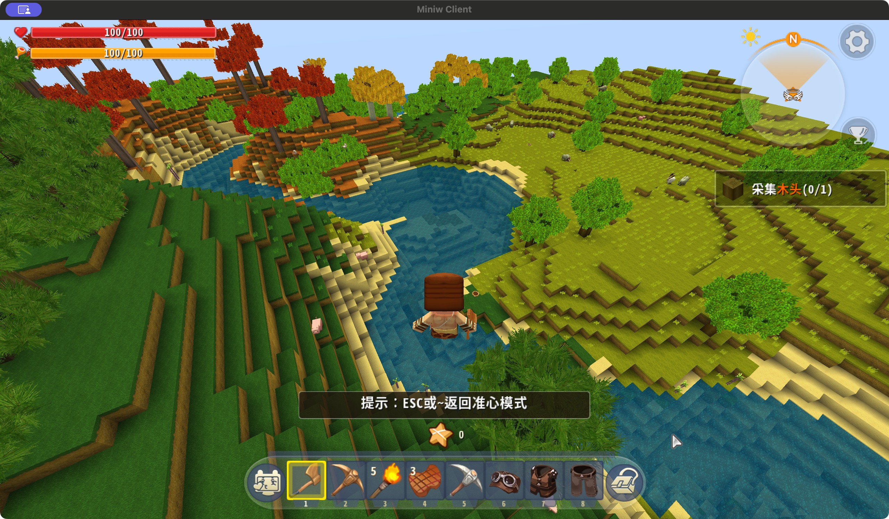
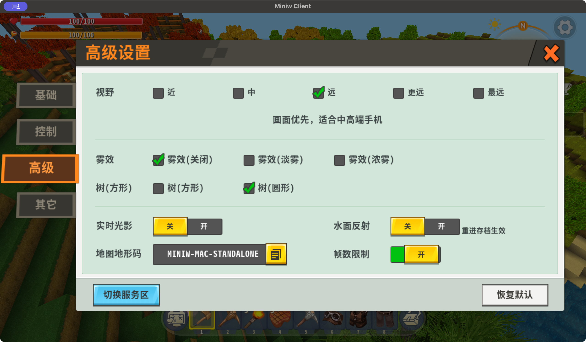

# Miniw-Client 视觉参照与 HelloMine3D 可行性分析

2026-09-12。按用户要求只分析 Miniw-Client 主线，排除 Metal 原型。本轮只新增分析和窗口证据，没有修改两个项目的运行代码。

## 结论

HelloMine3D 可以实现接近这份 Miniw-Client 实机画面的视觉风格，无须更换引擎。
主要差距是材质的美术语言、树叶几何、地形与植被构成，以及角色/工具资产完整度。
这需要把当前“暖野第一版”的材质与光色调整扩展为场景美术改造；仅调整光照参数无法消除方块树冠和像素颗粒感。
这里的“可以”是基于实际代码与画面的工程可行性判断，尚未实现、测量或承诺像素一致和性能一致。

## 本次实际看到的内容

启动 `build/MiniwClientMac-bridge-make/MiniwMac.app`，程序 SHA-256
`7f0824438723ddf877454ba0dda954ea5813301518af114b2286f225562f3a18`；仓库 HEAD `c10273d` 且已有未提交变更。
使用明确的开发直入/样本世界参数和新的临时运行目录观察，不能当作正常新世界生成验收。

看到的特征：绿色、橙红与黄色树冠形成大色块；树叶轮廓蓬松；草面细节细密、侧面颜色较均匀；河道、浅色沙岸和台阶状山坡清晰；水面可以看见河床；角色、动物、工具和物品图标风格一致。还切换了第一人称观察手持斧头。

设置页显示远视野、圆形树、实时光影关闭、水面反射关闭、雾关闭。
`ClientGameSurvive.cpp:257` / `258` 将玩家设置传给 `setShadowmap` / `setReflectmap`，与界面含义一致。
配置中另有底层 FX 默认值，不能只根据 `FXSetting waterreflect=true` 推断实际开启反射；玩家设置为 `reflect=0`。
本轮画面的主要优点在关闭这些效果时已经成立，不能归功于 Bloom、体积光或实时全局照明。

## 差距及实现路径

| 项目 | Miniw-Client 的实际证据 | HelloMine3D 当前状态 | 建议与成本判断 |
| --- | --- | --- | --- |
| 地表材质 | `grass_top.png`、`grass_side.png`、`sand.png` 为 128×128，草叶笔触和颗粒细密；生物群系形成成片色差 | 暖野图集 256×256、16×16 槽位，每格仍为 16×16 像素 | 做 64 或 128 像素级自然材质，降低大尺度噪点，保留清晰分面；中等工作量 |
| 树叶轮廓 | `BlockModelLeaf` 指向 `leaves` 模型，`blockgeom.xml` 指向 `leaves_model.obj`；有 `_m` 叶簇贴图和按坐标旋转 | `OakLeaf.block` 仍是 Cube；树冠轮廓由方块决定 | 为叶块增加成簇叶片渲染，保留方块碰撞/采集；这是优先级最高的结构差距；中等工作量 |
| 树形与生态 | 不同高度、轮廓和红/黄/绿树种同景出现；树生成器也有随机高度、冠部变化和藤蔓逻辑 | 橡树主要是两层方冠加顶部十字，棕榈使用十字枝叶；群系复用这些结构 | 增加少量差异显著的树形、灌木和成片分布；涉及生成规则，工作量中到高 |
| 河岸与水面 | 清楚的沙岸、可见河床、连贯水体；资源含动画水纹，渲染系统有独立水材质和可选反射 | 已有水面几何、天空颜色近似反射、Fresnel 和太阳高光；深浅色主要按距离与面方向估计 | 先统一沙岸/水底颜色和透明度，再增加水深驱动着色与纹理波纹；中等工作量 |
| 光照与色彩 | 关闭实时光影也能保持层次，草/土/沙明度区分明确 | 已有 AO、方向阴影、天空/雾、后处理和暖冷光色调制 | 延续当前渲染链，按新材质重标定颜色，之后再决定阴影质量；低到中等工作量 |
| 角色、动物、工具 | 第三人称角色、场景动物、第一人称斧头以及 UI 图标均有专门资产 | 敌人主要使用程序生成的分部件几何和纯色材质；第一版未改此范围 | 增加模型、UV/贴图、动画与手持展示资产；中到高工作量，独立一批 |
| UI | 图标、快捷栏底板、选中框与按钮均是专门绘制的资源 | 以 ImGui 控件和像素物品图标为主，主题已统一 | 可以保留目前更简洁的布局，补高质量图标与必要装饰；无需照搬全部移动端 HUD |

以上成本是相对范围判断，不是工期承诺。森林透明叶片的像素覆盖、纹理显存与远景闪烁必须实测；本轮未进行双方帧时性能对比。

## 为什么无需更换引擎

HelloMine3D 当前的 Ogre/GL3Plus 已具备透明裁剪、资源形状、材质参数、阴影、水面和后处理的基础。
`TerrainMaterialProfile.cpp` 已允许合法的图集/瓦片尺寸组合，并非渲染器只能接收 256×256。
但本项目当前的图集构建、120 个语义槽位检查及已批准暖野合同仍固定 256/16，升级资源时要同步构建与验收约束，不能只放大 PNG。
可以保留 16×16 个槽位，把每格升级到 64/128 像素；还需处理过滤、mipmap 和图集边缘串色。

`ChunkMeshBuilder.cpp` 已有资源形状路径，可以作为叶簇渲染的入口。
当前 `.shape` 顶点范围限定在 [0,1]；若新叶簇超出叶块边界，要显式设计渲染包围盒、区块剔除和阴影边界，不能仅放宽解析范围。
Miniw 的叶模型源文件只有 24 个顶点、12 个三角面，说明这种蓬松感并不依赖高模；关键是叶簇贴图、透明边缘、多方向面片与树冠分布。

两套 Ogre 体系并不兼容：Miniw 用深度定制的 `TechPassData`、编译 shader 和 `.omod/.ent/.emo` 等资源；HelloMine3D 用自己的 Ogre 材质与世界网格流程。
应借鉴效果和数据组织方式，针对 HelloMine3D 实现。直接搬整套渲染或资产加载器会引入大量无关耦合。

## 建议的下一轮范围

1. **先完成一个林地参照场景。** 保持相同机位和时间，升级草/土/石/木/叶/沙的贴图，并加入叶簇渲染，直接检验能否接近 Miniw 的观感。
2. **再改善场景构成。** 增加 3～4 种明显不同的树冠，减少重复排列，改善林缘、河岸和空地关系。生成规则变更需明确旧世界与新世界边界，旧存档不重生成。
3. **最后补水面、实体与界面细节。** 先做水深/透明度与少量代表性的动物、敌人、手持工具，再决定是否需要增加昂贵特效。

建议沿用“暖野”的自然、温暖和简洁方向，借鉴 Miniw 的叶簇、材质精度和场景层次；是否采用它更鲜艳的饱和度，应作为美术选择，而非技术要求。

## 可核查源码

Miniw-Client：

- [叶块模型与坐标旋转](../../../MiniGame/Miniw-Client/iworld/blocks/BlockModelLeaf.cpp)
- [叶模型资源绑定](../../../MiniGame/bin/res/blockgeom.xml)
- [树生成逻辑](../../../MiniGame/Miniw-Client/iworld/terrgen/EcosysUnit_Tree.cpp)
- [运行时图形设置](../../../MiniGame/Miniw-Client/iworld/ClientGameSurvive.cpp)
- [OpenGL 方块技术](../../../MiniGame/Miniw-Client/RenderSystem_OGL/OgreOGLTech_block.h)
- [水材质技术](../../../MiniGame/Miniw-Client/OgreMain/OgreShaderTech_block_water.h)

HelloMine3D：

- [当前材质尺寸](../../media/materials/Base.terrain-material)
- [图集参数范围](../../src/HelloMine3D/World/Block/TerrainMaterialProfile.cpp)
- [资源形状与网格](../../src/HelloMine3D/World/Chunk/ChunkMeshBuilder.cpp)
- [当前树形](../../src/HelloMine3D/World/Generation/Structures/TreeGenerator.cpp)
- [当前水着色](../../media/ogre/HelloMine3DWater.frag)
- [当前实体渲染](../../src/HelloMine3D/Ogre/OgreActorRenderer.cpp)

## 本次观察的限制与重载异常

这是现有构建包的实际画面与本地源码分析，不是本轮重新构建，也不是所有 shader 分支的 GPU 捕获。
静态场景不同、机位不同，不据此评判双方地形算法优劣或性能差距。

尝试通过设置切换方形树并重新进入时，后续窗口重新启动到默认 `Application Support/MiniwMac` 目录，点击继续后停在加载页；日志记录 `Save preflight rejected world 9999800: invalid player filename`。
发现后停止后续玩法操作并发送正常退出请求，没有强制结束进程、修改保存代码或手工修复正式数据；因此不能声明本轮默认运行目录完全未触及。
方形树模式的视觉对照未完成，不能作为树形 A/B 结果。最初的圆形树实机图和设置图均来自临时目录中的 PID 57231。
窗口原图、设置和包身份见 [观察记录](minigame-visual-reference-2026-09-12/observation.json)。
