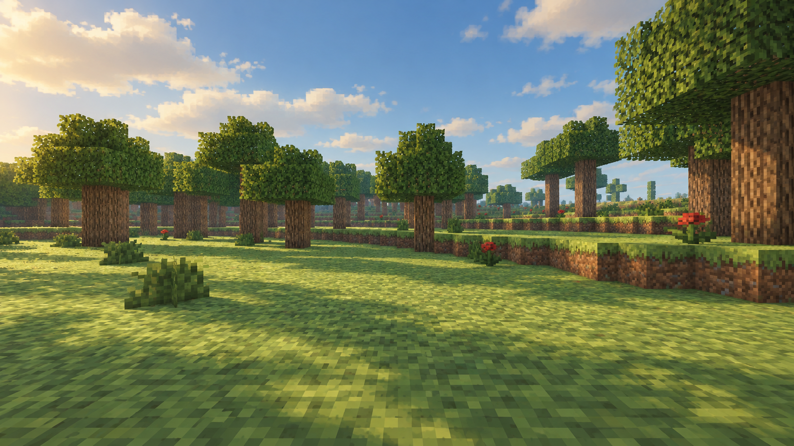

# HelloMine3D 视觉提案：暖野 / Warm Wilderness

日期：2026-09-10。分析基线：`a18ba59`；开始时工作区干净。
用户选择：**自然温暖、柔和光影、精致体素、清爽界面**。
本次交付为视觉分析、场景概念图及界面设计规范；未修改游戏运行时、资源包或当前批准批次。

## 1. 判断与证据

当前画面已经能表达体素世界，但材质细节、明暗关系和界面仍缺少统一的美术取舍。
最值得先解决的是铺满视野的纹理噪声和工程界面观感。增加更多特效本身不保证改善质感。

本次直接检查了最近 T1 的林地、山麓和正常菜单/暂停截图，并对照当前材质、shader、图集生成及 UI 源码。
这是对已有实机证据和当前实现的评审；本次没有启动游戏或重新采集画面。

| 观察 | 可见问题及原因判断 | 设计响应 |
| --- | --- | --- |
| [T1 林地](terrain-t0-t1-evidence/v5-mountain.png) | 草地高对比长条笔触反复排列，远处容易连成格栅；草、树皮、树叶都很“碎”，缺少安静的大色面 | 重画主要自然材质的明暗块面，先消除方向性和边缘拼缝，再做独立变体 |
| 同一林地 | 地面偏鲜绿、叶片偏黑绿，太阳照明与阴影的颜色关系不鲜明；重复树冠形状进一步放大单调感 | 苔绿/鼠尾草绿主色，暖直射光与冷环境光分离，叶片保持可辨认的中间调 |
| [T1 山麓](terrain-t0-t1-evidence/v5-ridge-foot.png) | 裸岩大面积重复同一灰色高频纹理，台阶面之间主要靠几何轮廓区分 | 岩石以低对比暖灰为底，少量成组裂隙；用光照表现大面转折 |
| [主菜单](terrain-t0-t1-evidence/normal-acceptance/t0-01-menu.png) / [暂停](terrain-t0-t1-evidence/normal-acceptance/t1-07-reopened.png) | 标题弱、巨大的黑色容器和等权蓝色按钮占据视觉中心；与自然环境缺少关联 | 场景成为主视觉，菜单靠左；主操作与次操作有明确层级，采用深苔色、米白和琥珀色 |
| 林地 HUD | 左侧 FPS 与旅程、右侧整段操作说明、底部生命与物品栏同时争夺视线 | 性能信息移入开发者模式；常驻当前目标、生命与五槽物品栏；教学按情境出现 |

补看了 [旧版夜景](../screenshots/validation-v10c-forest-night.png) 和
[旧版海面](../screenshots/validation-v10b3-ocean-noon.png)，只作历史外观参考，不能据此声称当前全档位夜景、水面已重测。
单帧无法证明闪烁、抗锯齿质量、阴影稳定性或帧率改善。

## 2. 已有能力与实现含义

- [图集参数](../../media/materials/Base.terrain-material) 已有 `256×256` 图集、`16×16` tile、饱和度/绿抑制/gamma。
  当前值 `colour_saturation=0.62`，已有降饱和处理；仅继续降低这个数值可能把画面变灰，不能消除重复纹理。
- [图集生成](../../tools/build_fs3_texture_atlas.ps1) 的生态变体主要复用基础 tile，旋转/镜像并以 `1.00/1.02/0.98` 微调亮度。
  已有变体机制，但同源纹样的辨识度仍强。新设计可以复用现有槽位绘制不同簇状细节。
- [顶点光照](../../src/HelloMine3D/World/Light/VertexLighting.cpp) 已有平滑光照和 AO；
  [阴影 shader](../../media/ogre/HelloMine3DTerrainShadow.frag) 已有方向阴影及 2×2 PCF。
  所以不能把建议描述为“首次加入 AO/阴影”。
- 当前 terrain shader 把材质乘以标量亮度、昼夜曝光及阴影可见度，未直接使用太阳 RGB 进行地形光照。
  [顶点 shader](../../media/ogre/HelloMine3DTerrain.vert) 输入也没有表面法线。
  概念图中的暖光冷影需要有范围的渲染改动；若采用法线相关漫反射，须评估几何导数重建或显式法线传递，不能当成一个现成参数。
- [水面 shader](../../media/ogre/HelloMine3DWater.frag) 已有 Fresnel、近似天空反射、太阳高光和观察距离驱动的颜色变化。
  这不是场景反射或真实水深；本提案不以新增 SSR、折射或深度水体作为首版前置条件。
- [后处理](../../media/ogre/HelloMine3DPostProcess.frag) 已有 Bloom、色调对比和抖动；[环境参数](../../src/HelloMine3D/World/Environment/WorldEnvironment.cpp) 已有昼夜、雾和云。
  首版应协调已有路径，不用更强 Bloom 掩盖材质问题。
- [UI](../../src/HelloMine3D/Ogre/OgreUserInterface.cpp) 使用 ImGui 默认深色样式；`drawHud()` 直接绘制性能面板。
  调整样式、绘制方式和布局就能明显改变观感，不要求换 UI 框架。隐藏性能面板后需同步解除目标面板对它的位置依赖。
- [材质采样](../../media/ogre/HelloMine3D.material) 使用 `filtering none`。远处纹理的稳定性值得检查，但目前只有静态证据。
  不能直接把整张 atlas 改成三线性过滤：需要处理 tile 边缘与 mip 串色，作为独立采样实验。

## 3. 新版视觉规范

### 3.1 美术方向

**暖野**：清新的林间空气、能读懂的体块、温暖的阳光、安静而有细节的材质。
保持一格方块的尺度和硬边；避免写实照片贴图、塑料高光、密集微体素和整屏柔焦。

| 角色 | 色板起点（sRGB） | 用法 |
| --- | --- | --- |
| 草地主色 | `#879967` | 柔和黄绿，亮部不发荧光 |
| 树叶主色 | `#526D49` | 中间调苔绿，阴面保留叶簇轮廓 |
| 土壤/树皮 | `#80634C` | 偏暖但降低细碎黑线 |
| 岩石 | `#92938A` | 暖灰大面、稀疏裂隙 |
| 远景雾 | `#BACBCD` | 降低远处对比，前景不过度发白 |
| 日光 | `#F3DDB3` | 暖米色，仅定义色彩方向，非线性光照参数 |
| UI 背景 / 文字 | `#202D27` / `#F4EEDC` | 让文字稳定可读，与森林色系一致 |
| 强调 / 危险 | `#DEB66E` / `#C97564` | 琥珀标记选择和主操作；砖红对应伤害，配合形状与文字 |

色值为艺术起点，不能直接复制成最终 shader 线性空间数值。需要结合现有颜色变换检查全链路。

### 3.2 材质

- 草顶：同一材质先读成连续地面，再看见少量像素簇；去掉贯穿 tile 的长暗线和“方框边”。
- 草侧：草皮顶部有短而不等距的下垂，泥土用少量大块色阶；侧面方向保持正确。
- 石头：先有整体色面，再放少量裂隙。矿石继续以明确形状区分，避免风格化后与普通岩石混淆。
- 树皮：两三组宽纹理表达纵向生长，减少近黑色窄线；年轮、侧面和切面保持一致。
- 树叶：成簇明暗加稀疏透空；不通过大量新增透明面堆出“蓬松感”。
- 第一版保留现有 tile 大小、槽位、材质/物品身份及五槽背包语义。先验证美术取舍，再决定是否需要提高分辨率。

### 3.3 光照与空间

- 白天：温暖的受光面、偏冷的环境补光；树下能认出土、草和目标，不把阴影压成黑洞。
- 清晨/傍晚：让色温和方向渐变，控制高光，不让整片森林统一变橙。
- 夜间：青蓝轮廓与局部暖光互相区分，保留昼夜及火把的玩法意义；不全局提亮到白昼。
- AO 用在根部和接触处，保持局部；远景逐渐降低对比度，不在近处叠重雾。
- 水面先协调色彩、反射强度和波动幅度。真实岸线深浅、河道和树群布局另属水体/生成工作。

### 3.4 HUD 与菜单

- 游玩界面：左上仅当前目标标题和数量，教程细节按需要展开；底部居中保留五个物品槽、生命值及所持物名称。
- 物品以清晰的小图标、数量和统一留白组织；所持槽用琥珀描边和浅填色，不用整片亮黄。
- 伤害方向、采集进度、食物冷却和格挡仍有独立的临时反馈位置。音效字幕保留可访问选项，避免覆盖物品栏。
- 主菜单：左侧品牌及“单人游戏”主操作，下方“制作人员”“退出游戏”；沿用现有 Worlds 导航。
  右侧展示世界风景。首版可用随包静态场景图，实时菜单背景另行评估，不在菜单偷偷运行玩家存档。
- 暂停、制作和箱子共享同一色板、间距和焦点样式。中文使用现有 Noto Sans SC 资源，正文以中等字重和较高对比提升清晰度。
- 建议基准：1080p 正文 18–20 px、辅助字 14–16 px、主要操作高 44–48 px、间距按 8 px 倍数；
  最终按物理像素/UI scale 统一换算，必须复核中英文及三档字号。
- 动效短而可中断：菜单淡入约 160 ms、槽位反馈约 100 ms。画面不依赖镜头晃动或重模糊提供质感，减少动态模式有静态反馈。

## 4. 概念图与交付状态

概念图通过内置 imagegen，以 T1 `v5-mountain.png` 林地实机截图作编辑参考生成。
它用于展示材质、配色和光照目标，**不是引擎输出、同条件 A/B 证据或性能承诺**。
生成画面可能改变局部物体细节；参考截图与概念图的照明时间也不同。
完整提示词保存在 [imagegen-prompt.txt](visual-direction-warm-wilderness-2026-09-10/imagegen-prompt.txt)。

目前完成了场景概念图和上述界面设计规范。原计划的 HUD/主菜单交互预览尚未制作，
后续讨论已转向实机实施方法。游戏中的 UI、材质和渲染效果均尚未改动。

## 5. 建议实施顺序

| 顺序 | 具体交付 | 规模与验证重点 |
| --- | --- | --- |
| 1 | 草顶、草侧、土、石、木、叶材质试版；HUD/菜单主题与布局 | 小–中；先做同一林地场景的实机切片。图集/资源包检查、UI 布局/输入检查、中英文三档字号 |
| 2 | 地形暖光冷影、阴影/AO/雾协调；普通与阴影路径保持一致 | 中；shader 接口和资源包负例、低档回退、白昼/傍晚/夜晚/洞口对照及 GPU/帧时间 |
| 3 | 森林疏密、空地、树冠轮廓，随后岸线适地改善 | 中–大；改变生成结果时必须使用新的版本身份，保护已有 v1–v5 世界，不把概念图当成改地形的授权 |

最先值得实际制作的是“同一片林地的材质 + HUD + 光色切片”。完成这一个场景后，
再把确认过的语言推广到山地、水边、夜景和制作界面。没有依据承诺“一键达到概念图”或固定开发天数。

实现时按 [验证矩阵](../current/validation-matrix.md) 选择必要检查；固定 seed、机位、朝向、时间、视距、档位、分辨率对照。
材质收益还要在阴影关闭及正午条件下成立，避免仅靠黄金时段截图；动态检查覆盖斜视草地、移动树叶、阴影边缘和区块流送。
本轮仅新增设计交付，未执行构建、游戏回归、实机视觉或性能验收，未本地提交。

## 6. 首版实施操作说明

建议后续实现采用三个可独立回退的工作单元，全部在同一片固定林地验证效果。

1. **材质资源**：单独绘制可平铺的草顶、草侧、土、石、树皮和叶片 tile；场景概念图不能直接充当纹理图集。
   保持现有语义槽位和 Alpha 约定，更新图集源及 `tools/build_fs3_texture_atlas.ps1` 的对应构建步骤，
   重建 `media/textures/DefaultPack.png`；生态变体同步重做，确认 HUD 和手持资源仍能正确读取。
   先在现有光照下对照平铺接缝、近景细节与远景稳定性，通过资源和图集检查。
2. **界面主题**：在 `OgreUserInterface.cpp` 提炼颜色、间距、字体和控件样式；调整主菜单、HUD、暂停、制作和容器的一致性。
   给常驻性能叠层增加显式开发者可见性控制，同步目标面板定位与验证探针。
   菜单进入 Worlds、保存退出、制作与容器的实际动作保持原语义；完成焦点、键鼠和多语言字号检查。
3. **光色切片**：在现有普通/阴影 terrain shader 上协调受光与环境颜色，以及 AO、阴影和雾的叠加关系。
   CPU 参数绑定、`.program`/`.material`、shader 合同和低档回退一起修改，避免只改一条渲染路径。
   比较同机位的正午、午后、夜间和阴影关闭状态，再扩展到山地、水边和洞口。

首版退出结果应为：可运行的 macOS 构建、原版与新版固定条件截图、必要自动回归和针对性性能对照、
已知差异记录。性能目标以实测基线制定，不用概念图推导帧率。
首版保持当前地形与存档数据语义；纯材质/光照会改变旧世界的显示外观，但不应重新生成或覆盖世界方块。
