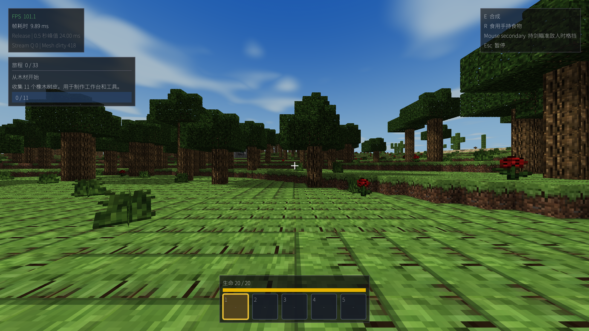
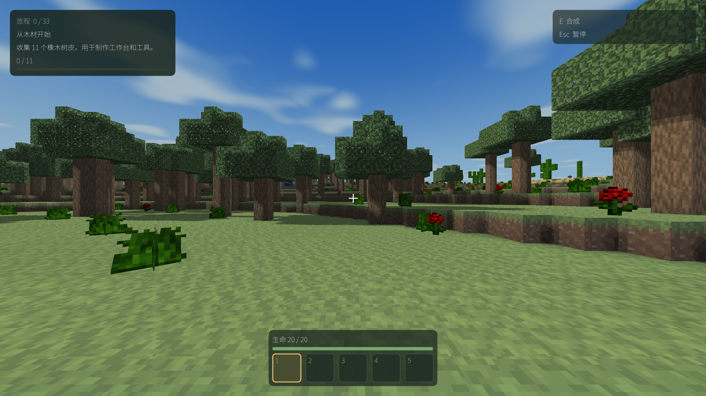

# 暖野第一版实施记录

状态：第一版工程完成。用户于 2026-09-12 授权实施；起点 `a18ba59`，以下证据采集时改动尚未提交。
用户后续授权后，第一版与后续材质修正已按资源、渲染、界面和工具分批本地提交，
见 [M1 提交记录](warm-wilderness-m1-implementation-2026-09-12.md)；未推送，本文保留第一版实际证据。
范围和预先固定的性能护栏见 [合同](../contracts/warm-wilderness-visual-contract-v1.md)。

## 交付

可运行包：[HelloMine3D-Warm-v1.app](../../build/warm-visual-20260912/HelloMine3D-Warm-v1.app)。
这是 r3 验证包的逐文件 SHA-256 验证副本，不含测试配置、夹具世界或用户存档。
macOS Release x86_64；在 Apple Silicon / macOS 15.7.3 上实际运行。未签名或公证。
可执行文件 SHA-256：`42b867b3c062f305f6543e791c7cd2d1fd36c2ede64ac0afce067941771d018c`。
包中 `Contents/Resources/distribution-sha256.txt` 记录 107 个文件，资源清单包含 86 项有效资源。

- 替换草、土、石、木、叶材质及生态派生；保留未改物品图标与透明类别。母版、提示词、哈希和重建入口见 [资产说明](../art-sources/warm-wilderness-build.md)。
- 地形接入有界暖光/冷影调制，沿用已有光照、AO 与阴影；无新增顶点属性或离屏目标。夜间保持暗度，大气回退关闭新调制。
- 主菜单加入静态背景画，统一深绿/暖金控件；HUD 收拢为当前旅程、生命和五槽物品栏。Esc 可查看旅程详情，F1 保留调试信息。
- 制作和容器物品名/数量分行显示，过长名称按完整 UTF-8 字符省略并提供提示；字幕放在面板外。大字号制作界面使用滚动访问底部操作。
- 存档 v12、地形 v1–v5、设置 v8、方块身份及玩法真值保持兼容。树形、水系、敌人美术未纳入此次改造。

## 实际画面

以下林地截图来自固定机位运行诊断，seed 20260807，时间起点 9500，High 阴影/后处理 On，启动后 5 秒。
逻辑窗口 1280×720，Retina 原图 2560×1440；世界时间正常推进，并非锁帧像素比较。

原版：

第一版：

补充：[夜间](warm-wilderness-evidence/night-after.png)、[山麓](warm-wilderness-evidence/ridge-after.png)、
[制作](warm-wilderness-evidence/crafting-after.png)、[容器](warm-wilderness-evidence/container-after.png)。
[主菜单](warm-wilderness-evidence/menu-after.png) 使用生成的静态艺术图，不能作为当前世界渲染效果证据。
每张精选图旁的 JSON 保留采集参数、包身份和原始输出路径。

## 检查结果

| 检查 | 结果 |
| --- | --- |
| Debug / Release 客户端 | r3 两配置编译通过 |
| WorldRuntime | 两配置各 1014/1014 |
| ResourcePack | 两配置各 86/86，含新增 shader 接口缺失负例 |
| MeshDirty | 两配置通过 |
| 资产清单 | 75/75 |
| 图集 | 120 语义、136 空槽、全部 Alpha、26 方块分面、43 图标映射、原样保留图标、文件级确定性重建、5 个破坏负例通过 |
| 中英文 × 0.85 / 1.0 / 1.25 | 菜单、HUD、制作、容器共 24 组初始布局实机图已审阅 |
| 暂停与设置 | Computer Use 正常设置切换，两语言三字号暂停布局已审阅；主要按钮完整可达 |
| 日夜、山麓、大气回退 | 已运行与审阅，回退使用旧大气路径并保留新材质 |

日志和汇总在 [证据目录](warm-wilderness-evidence/)，[索引](warm-wilderness-evidence/evidence-index.json) 包含文件哈希。
所有原始采集、旧候选、日志与失败记录保留在 `build/warm-visual-20260912/`。

正常输入自测使用干净副本，通过 Computer Use 点击主菜单、新建 `Warm Visual UI` 世界（正常输入 seed 20260807）、进入游戏、暂停、修改语言与字号、恢复、按 E 打开制作、滚动到底部、关闭、F1 开关、保存返回菜单并退出。
没有注入物品或强制机位。无材料时制作按钮禁用符合预期。保存的窗口证据：[英文大字号暂停](warm-wilderness-evidence/paused-en-125.png)、[中文小字号暂停](warm-wilderness-evidence/paused-zh-085.png)、[制作底部操作](warm-wilderness-evidence/crafting-scroll-en-125.png)。
这属于实现者定向自测，不是独立盲玩或完整主线验收；容器布局采用明确标记的开发夹具，本轮未通过正常采集制作箱子并测试物品往返。

## 性能

基线包 `HelloMine3D-T1-v5.app` 来自 `850dd85`，其后至 `a18ba59` 只有文档变化。
基线可执行文件 SHA-256：`221f50c5aa4669ea8a54ab8fa8f121bede39d58b2fa967307bd1224d119997c7`。
前后均固定 seed、林地机位、RD8、FOV90、窗口、HUD 夹具；每档三轮，预热 5 秒、采样 30 秒。
按合同取各轮 P95/P99 的中位数，均须 ≤ 原版的 110%。单位毫秒，越低越好。

| 阴影 / 后处理 | 原版 P95 / P99 | 暖野 P95 / P99 | 比值 P95 / P99 | 结果 |
| --- | --- | --- | --- | --- |
| Off / Off | 11.942 / 12.627 | 11.889 / 12.278 | 0.996 / 0.972 | PASS |
| Medium / Off | 10.537 / 13.850 | 10.481 / 11.197 | 0.995 / 0.808 | PASS |
| High / On | 10.558 / 23.019 | 10.121 / 23.424 | 0.959 / 1.018 | PASS |

完整九轮前后数值见 [性能 JSON](warm-wilderness-evidence/performance-comparison.json)。High 新版第一轮 P95 为 23.116 ms，保留该波动，没有删除样本或追加择优轮次；本结论是预先约定的三轮中位数护栏通过，不代表消除了卡顿。
两边加载/存在区块中位数均 361，更新队列均归零；Off/Medium 地形驻留几何与显存字节中位数一致，High 约 -0.005%，面数差异最多约 -0.06%。顶点/索引步长仍为 32/4 字节。

## 失败与边界

- 首次沙箱启动出现 LaunchServices -10827；随后使用桌面执行权限成功。首次构建因模块缓存写权限失败，重跑成功；原日志保留。
- 首次 WorldRuntime 有 1 项失败：新增两条文案后精确键数仍为 428。改为 430 并增加对应文案检查后，两配置通过。
- r1/r2 发现字幕覆盖制作格和英文数量截断；r3 修复后重新构建、截图与采集性能。
- 正常窗口证据首次因同一应用有两个窗口而拒绝抓取；选择查询得到的游戏窗口 ID 后成功，无桌面截图替代。
- `coast` 固定机位实际落入水下，因此仅作为水下渲染诊断，不声称海岸构图或水下美术已经完成。水体底面接缝仍可见，水系与水材质不是本轮改造范围。
- Windows 未运行；正式独立玩法验收和人类审美认可未声明。本轮结论限于第一版视觉实现、macOS 工程验证与定向界面自测。
