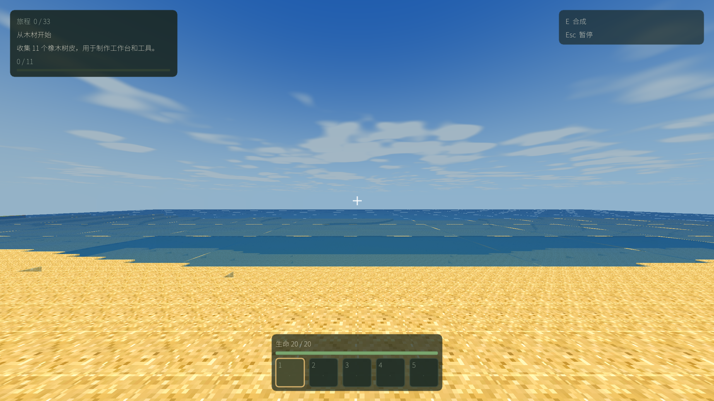

# 水面区块接缝修复

2026-09-12，用户截图缺陷修复已完成。起点 `a18ba59` + 已有暖野改动；用户另行授权本地提交，未推送。

## 原因与修复

`ChunkSectionRenderable::buildVertexStream` 上传前减去 section 原点，GPU `vertex` 是区块内坐标；
scene node 的 `world` 矩阵负责恢复世界坐标。水面 shader 却直接用 `vertex.x/z` 计算两组波浪相位。
于是同一条边在左区块使用 16、在右区块使用 0，波浪高度和解析法线在每 16 格边界重新开始。
这是截图中规则亮缝及分块光色的原因。水面原有下沉 0.1 格不是本次接缝根因。

`media/ogre/HelloMine3DWater.vert` 改为先取 `world * vertex`，再用世界 X/Z 计算相位。
高度和法线仍从同一组相位派生，保留原波幅、平均水位、透明混合和动画时间绑定。
不改变 CPU 网格、32 字节顶点布局、面剔除、区块/存档/世界生成或玩法。

## 验证

平台：macOS 15.7.3 / Apple M1 Pro。游戏是已有 Release x86_64 客户端；本次只改运行时加载的
GLSL，不声称重新构建了 C++ Debug/Release。独立 GPU 探针由 Apple Clang 17.0.0 编译为 arm64。

| 检查 | 结果 |
| --- | --- |
| 原 shader 的 GPU 边界复现 | FAIL（预期）：210 对，最大位置差 0.0989227 格、法线分量差 0.0494372 |
| 修复 shader 的相同 GPU 边界回归 | PASS：210 对，位置差与法线差均为 0 |
| ResourcePack | PASS：86/86，使用现有二进制重跑 |
| WorldRuntime V10A 聚焦（含 M4 水面拓扑） | PASS：39/39，使用现有二进制重跑 |
| MeshDirty | PASS，使用现有二进制重跑 |
| 岸边、水下，5s / 10s 原始运行时读回 | PASS：前后 8 张原图；修复后未见区块亮缝 |
| 静态性能 | PASS：P95 +4.91%，P99 −3.46%；常驻几何与缓冲字节一致 |
| 流送首组性能 | FAIL：P95 +24.72%，P99 +39.59%；保留结果并追加两组交替顺序诊断 |
| 流送全部三次中位数 | PASS：P95 +1.86%，P99 −6.94%，未放宽 10% 门槛；各轮仍有明显波动 |
| Windows / 独立正常玩法 | NOT_RUN；此次是定向渲染缺陷验证 |

GPU 工具直接编译并执行传入的生产 shader，以 transform feedback 读回世界位置与法线，
没有在 CPU 重写一份波浪算法。覆盖 X/Z 两个方向、正负坐标、原点、边角及 5 个动画时刻。
同样验证位移仍落在原有 `[−0.16, −0.04]` 格范围。命令（仓库根执行）：

```sh
clang++ -std=c++17 -Wno-deprecated-declarations tools/validate_water_shader_macos.cpp \
  -framework OpenGL -o build/water-seam-20260912/validate-water-shader
build/water-seam-20260912/validate-water-shader media/ogre/HelloMine3DWater.vert
bin/HelloMine3DResourcePackSmoke
HELLOMINE3D_WORLD_SMOKE_FOCUS=V10A bin/HelloMine3DWorldRuntimeSmoke
bin/HelloMine3DMeshDirtyTests
```

岸边同用户截图：seed 20260807，初始位置 `(0,82,512)`、朝向 `(0,0,0)`、时间 6000。
水下补充使用 `(-256,70,-256)`。RD8、FOV90、逻辑窗口 1280×720、读回 2560×1440，
阴影/后处理 Off。世界时间正常推进，截图不是同一动画时刻的像素差测试。

修复前：



修复后：


其余原图、采集参数、运行身份、检查日志和 SHA-256 在
[证据目录](water-seam-evidence-20260912/sha256.json)。所有尝试原样保留于
`build/water-seam-20260912/`，含沙箱 LaunchServices/OpenGL 不可用与探针首版缺少
offscreen framebuffer 的失败。补齐 framebuffer 后原版确实失败、修复版通过。

## 性能与交付

同一岸边起点，5s 预热、30s 采样；流送使用既有 `fast-streaming` 开发诊断。
最终静态/流送采集依次执行，期间未运行其他 GPU 测试或编译。
早期 `before/after-coast/shore` 采样与探针/其他检查有时间重叠，只作画面证据。

静态 P95 / P99 为原版 `11.964 / 16.516 ms`、修复版 `12.551 / 15.945 ms`。
常驻顶点/索引 `644756 / 1319142`、buffer `25908760 bytes` 前后完全相同。
最大帧原版 311.885 ms、修复版 322.093 ms；保留卡顿，不能据此宣称消除了长帧。

首组流送 P95 / P99 为原版 `12.893 / 16.296 ms`、修复版 `16.080 / 22.748 ms`，
超过 10% 门槛，记为 FAIL。CPU update P95 同时由 9.322 升至 11.299 ms，
chunk-visible P95 则由 231.514 降至 209.282 ms，不能仅凭此样本确定 shader 因果。
在追加采集之前保存 `streaming-repeat-plan.json`：固定再加两组，顺序为 after→before、
before→after，使用全部三次中位数并保持 10% 阈值；不删除首组或挑选最好样本。

| 流送轮次 | 原版 P95 / P99（ms） | 修复版 P95 / P99（ms） |
| --- | --- | --- |
| 1 | 12.893 / 16.296 | 16.080 / 22.748 |
| 2 | 12.992 / 15.429 | 13.133 / 15.165 |
| 3 | 12.711 / 16.949 | 7.359 / 10.297 |
| 全部三次中位数 | 12.893 / 16.296 | 13.133 / 15.165 |

三次中位数 P95 +1.86%、P99 −6.94%，满足保持的 10% 门槛；常驻顶点、索引、buffer
中位数分别为 `867372 / 1712106 / 34604328 bytes`，前后一致。
这只支持本次 30s 定向回归；各轮离散度和原有约 300 ms 长帧均保留，不能声称稳定提速或
替代完整六场景 Q1/长期压力。原始 CSV、采集命令与完整数值见
[首组对照](water-seam-evidence-20260912/performance-comparison.json) 和
[三次流送对照](water-seam-evidence-20260912/streaming-three-run-comparison.json)。

可运行包：[HelloMine3D-Water-Fixed.app](../../build/water-seam-20260912/HelloMine3D-Water-Fixed.app)。
107 项文件清单已保存；与暖野 v1 包相比只有 Water.vert 这一项运行时资源发生变化。
可执行文件 SHA-256：`42b867b3c062f305f6543e791c7cd2d1fd36c2ede64ac0afce067941771d018c`。
修复 shader SHA-256：`cf5586024f5d4f274a97e80290954ece28cd019153ca89a589aca491d8f95253`。
旧交付包与用户存档保留，运行修复包或从当前工作区重新启动游戏即可加载新 shader。
